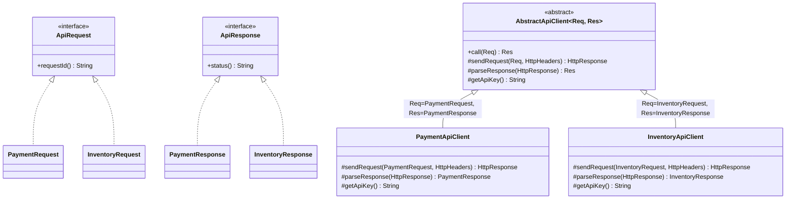
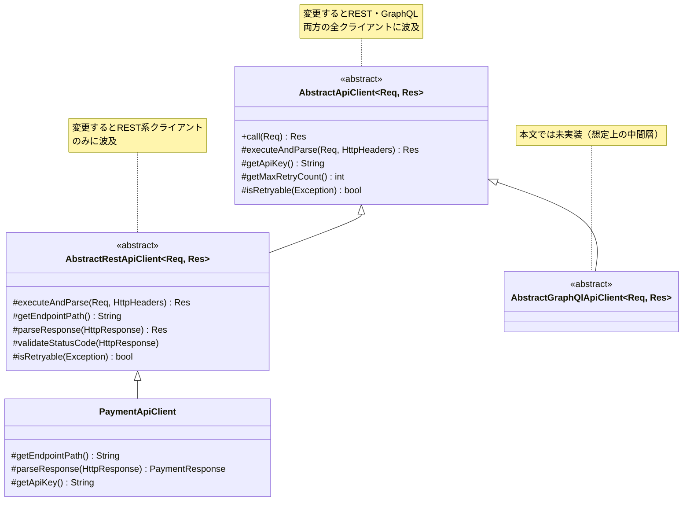

## はじめに

Javaで開発をしていると、抽象クラスを使った共通化にはよくお世話になります。
処理の共通部分を親クラスにまとめられて、うまくハマったときはうれしい気持ちになります。

一方で、抽象クラスは**扱いを少し間違えると、そのまま技術的負債になりやすい**道具だとも感じています。

本記事では、**抽象クラスと上手に付き合う方法を軸**に扱います。
Template Methodパターンとジェネリクスを使い、型安全で保守しやすい外部APIクライアント基盤を設計していく流れを追います。

後半では、抽象クラス設計でありがちなアンチパターンや、継承そのものの限界と使い所についても掘り下げます。

## Template Methodパターンとは

抽象クラスを負債にせず活用する手立ては、いくつも考えられます。
本記事ではそのなかの一例として、**Template Methodパターン**を取り上げ、抽象クラスを適切に扱うとはどういうことかを具体的に見ていきます。

Template Methodパターンは**処理の流れを親クラスで固定し、個別の実装を子クラスに委譲する**デザインパターンです。

```java:AbstractReportGenerator.java
public abstract class AbstractReportGenerator {
    // Template Method：処理フローを固定する
    public final Report generate() {
        Data data = fetchData();
        Data formatted = format(data);
        return output(formatted);
    }

    // Template Methodで呼ばれるメソッドは子クラスで実装する
    protected abstract Data fetchData();
    protected abstract Data format(Data data);
    protected abstract Report output(Data data);
}
```

`generate()`メソッドが処理の流れを次のように定めており、子クラスは各ステップの中身だけを実装します。

1. データ取得：`fetchData()`メソッド
2. データ整形：`format()`メソッド 
3. データ出力：`output()`メソッド

また、`generate()`メソッドのアクセス修飾子は`final`とし、子クラスから変更できないようにします。
これにより、子クラス間の実装が統一され、コードの再利用性を高めることができます。

## Template Methodの実装例 - 外部APIクライアント基盤を4ステップで作る -

今回は決済APIと在庫APIを扱う外部APIクライアント基盤の実装を例として、Template Methodの実装について解説していきたいと思います。

### Step0：抽象クラスなし

まずは何の工夫もない状態から始めます。
細かい実装は省略していますが、今回紹介するサンプルコードは次の通りです。

```java:PaymentApiClient.java
/** 決済APIクライアント */
public class PaymentApiClient {

    public PaymentResponse call(PaymentRequest request) {
        // 認証ヘッダ付与
        HttpHeaders headers = new HttpHeaders();
        headers.set("Authorization", "Bearer " + getApiKey());
        // リトライ処理
        int retryCount = 0;
        Exception lastException = null;
        while (retryCount < 3) {
            try {
                log.info("Calling Payment API: {}", request);
                // API実行
                HttpResponse response = httpClient.post("/payments", request, headers);
                return objectMapper.readValue(response.getBody(), PaymentResponse.class);
            } catch (Exception e) {
                lastException = e;
                retryCount++;
                log.warn("Retry {} for Payment API", retryCount);
            }
        }
        throw new ApiCallException("Payment API failed", lastException);
    }

    private String getApiKey() {
        return "dummy-payment-api-key";
    }
}
```

```java:InventoryApiClient.java
/** 在庫APIクライアント */
public class InventoryApiClient {

    public InventoryResponse call(InventoryRequest request) {
        // 認証ヘッダ付与（Payment側とほぼ同じ）
        HttpHeaders headers = new HttpHeaders();
        headers.set("Authorization", "Bearer " + getApiKey());
        // リトライ処理（これもコピペ）
        int retryCount = 0;
        Exception lastException = null;
        while (retryCount < 3) {
            try {
                log.info("Calling Inventory API: {}", request);
                // API実行（Payment側とほぼ同じ）
                HttpResponse response = httpClient.post("/inventory", request, headers);
                return objectMapper.readValue(response.getBody(), InventoryResponse.class);
            } catch (Exception e) {
                lastException = e;
                retryCount++;
                log.warn("Retry {} for Inventory API", retryCount);
            }
        }
        throw new ApiCallException("Inventory API failed", lastException);
    }

    private String getApiKey() {
        return "dummy-inventory-api-key";
    }
}
```

#### 問題点

見ての通り、**認証・リトライ・ロギングが完全にコピペ**になっています。

- リトライ回数を3回から5回に変えたいだけで、全クライアントを修正して回る必要がある
- 3つ目・4つ目のクライアントを追加する人は、既存クラスを探してコピーするところから始めることになり、実装の一貫性が誰にも担保されない

共通のフロー部分をどこかに抽出したい、というのが最初の課題です。

### Step1：抽象クラスを導入

そこで、処理フローを抽象クラスのメソッドに定義します。
抽象クラスを作成する前に、まずはリクエストとレスポンスに必要な契約を定義します。

```java:共通インタフェース
public interface ApiRequest {
    String requestId();
}
public interface ApiResponse {
    String status();
}
```

ここで`ApiRequest`/`ApiResponse`を作る目的は、抽象クラス（Template Method）が必要とする、リクエスト・レスポンスとして最低限これができる、という契約を定義するためです。
共通フィールドを親クラスに持たせることではありません。

この契約があることで、抽象クラスは具体的な`PaymentRequest`や`InventoryRequest`を知らなくても、`requestId()`を使ってログを出力できます。
これは、インタフェース越しに同じ操作を扱えるという意味で、ポリモーフィズムの一例です。

各APIのリクエスト・レスポンスは、このインタフェースを実装します。
固有フィールドと合わせて`record`で定義します。

```java:各APIの型定義
public record PaymentRequest(
    String requestId, LocalDateTime requestedAt,
    String cardNumber, BigDecimal amount
) implements ApiRequest { }

public record PaymentResponse(
    String status, LocalDateTime respondedAt,
    String transactionId, BigDecimal chargedAmount
) implements ApiResponse { }

public record InventoryRequest(
    String requestId, LocalDateTime requestedAt,
    String sku, int quantity
) implements ApiRequest { }

public record InventoryResponse(
    String status, LocalDateTime respondedAt,
    int remainingStock, boolean reserved
) implements ApiResponse { }
```

抽象クラス側はこうなります。

```java:AbstractApiClient.java
public abstract class AbstractApiClient {

    // Template Method：処理フローを固定化
    public final ApiResponse call(ApiRequest request) {
        HttpHeaders headers = new HttpHeaders();
        // ★子クラスでgetApiKeyメソッドの実装をする
        headers.set("Authorization", "Bearer " + getApiKey());

        int retryCount = 0;
        Exception lastException = null;
        while (retryCount < 3) {
            try {
                log.info("Calling API: requestId={}", request.requestId());
                // ★子クラスでsendRequestメソッドの実装をする
                HttpResponse response = sendRequest(request, headers);
                // ★子クラスでparseResponseメソッドの実装をする
                return parseResponse(response);
            } catch (Exception e) {
                lastException = e;
                retryCount++;
                log.warn("Retry {}", retryCount);
            }
        }
        throw new ApiCallException("API call failed", lastException);
    }

    protected abstract HttpResponse sendRequest(ApiRequest request, HttpHeaders headers);
    protected abstract ApiResponse parseResponse(HttpResponse response);
    protected abstract String getApiKey();
}
```

子クラスの実装はこうなります。

```java:PaymentApiClient.java
public class PaymentApiClient extends AbstractApiClient {

    @Override
    protected HttpResponse sendRequest(ApiRequest request, HttpHeaders headers) {
        // PaymentRequest固有のフィールドを使うためにキャストが必要
        PaymentRequest paymentRequest = (PaymentRequest) request;
        return httpClient.post("/payments", paymentRequest, headers);
    }

    @Override
    protected ApiResponse parseResponse(HttpResponse response) {
        return objectMapper.readValue(response.getBody(), PaymentResponse.class);
    }

    @Override
    protected String getApiKey() {
        return "dummy-payment-api-key";
    }
}
```

抽象クラスを導入することでコピペは解消されました。
ただし、単に抽象クラスを導入するだけでは別の課題が発生してしまいます。

以降、具体的にどんな問題が起きるかについて見ていきます。

#### 問題点：キャストが散在する

`sendRequest()`の引数は`ApiRequest`型なので、`cardNumber`や`amount`といった固有フィールドを使うには**ダウンキャストが必要**になります。

さらに、`call()`の戻り値も`ApiResponse`までしか表せないため、呼び出し側でも具体型へのキャストが必要になります。

```java:呼び出し側でもキャストが要る
PaymentApiClient client = new PaymentApiClient();
ApiResponse response = client.call(new PaymentRequest(...));

// transactionIdを使うには結局キャストが必要
PaymentResponse paymentResponse = (PaymentResponse) response;
```

共通の項目（`status()` など）はインタフェース経由で扱えますが、**固有フィールドを扱う瞬間に必ずキャストが要求される**構造になっています。

#### 問題点：型の取り違えが実行時まで発覚しない

そして、より深刻なのはこちらです。

```java:誤ったキャスト
InventoryApiClient client = new InventoryApiClient();
ApiResponse response = client.call(new InventoryRequest(...));

// InventoryResponseが返ってくるのに、誤ってPaymentResponseにキャスト
PaymentResponse wrong = (PaymentResponse) response;
```

```text:実行時エラー
Exception in thread "main" java.lang.ClassCastException:
class InventoryResponse cannot be cast to class PaymentResponse
```

厄介なのは、このコードは**コンパイルが通ってしまう**点です。

- 宣言：親クラス（`ApiResponse`）
- 実体：`InventoryResponse`
- キャスト先：`PaymentResponse`

`PaymentResponse`、`InventoryResponse`も同じ`ApiResponse`を親に持つため、コンパイラはあり得る操作だと判断し、コンパイルを通してしまいます。
実際には`InventoryResponse`の実体が入っているので、実行時に`ClassCastException`で落ちます。

この構造では、コンパイル時に検出できず、実行時まで型の取り違えに気づけないため、保守上のリスクが残ります。

### Step2：ジェネリクスで型安全に

この問題を解決するために、ジェネリクスを導入します。

ただし、補足しておくと、**Template Methodとしての骨格はStep1で完成しています**。
`call()` が処理フローを固定し、子クラスが各ステップを埋める、という構造はこの先も変わりません。

ここから導入するジェネリクスは、その骨格に型安全を上乗せするための脇役、という位置づけです。

```diff_java:AbstractApiClient.java
- public abstract class AbstractApiClient {
+ public abstract class AbstractApiClient<Req extends ApiRequest, Res extends ApiResponse> {

    // Template Method：処理フローを固定化
-   public final ApiResponse call(ApiRequest request) {
+   public final Res call(Req request) {
        HttpHeaders headers = new HttpHeaders();
        headers.set("Authorization", "Bearer " + getApiKey());

        int retryCount = 0;
        Exception lastException = null;
        while (retryCount < 3) {
            try {
                log.info("Calling API: requestId={}", request.requestId());
                HttpResponse response = sendRequest(request, headers);
                return parseResponse(response);
            } catch (Exception e) {
                lastException = e;
                retryCount++;
                log.warn("Retry {}", retryCount);
            }
        }
        throw new ApiCallException("API call failed", lastException);
    }

-   protected abstract HttpResponse sendRequest(ApiRequest request, HttpHeaders headers);
-   protected abstract ApiResponse parseResponse(HttpResponse response);
+   protected abstract HttpResponse sendRequest(Req request, HttpHeaders headers);
+   protected abstract Res parseResponse(HttpResponse response);
    protected abstract String getApiKey();
}
```

`Req extends ApiRequest`、`Res extends ApiResponse`という**境界型**を設けることで、インタフェースを実装したリクエスト・レスポンスである、という制約は保ったまま、子クラスで具体型を確定できます。

```java:PaymentApiClient.java
public class PaymentApiClient extends AbstractApiClient<PaymentRequest, PaymentResponse> {

    @Override
    protected HttpResponse sendRequest(PaymentRequest request, HttpHeaders headers) {
        // キャスト不要。cardNumber, amountに直接アクセスできる
        return httpClient.post("/payments", request, headers);
    }

    @Override
    protected PaymentResponse parseResponse(HttpResponse response) {
        return objectMapper.readValue(response.getBody(), PaymentResponse.class);
    }

    @Override
    protected String getApiKey() {
        return "dummy-payment-api-key";
    }
}
```

```java:InventoryApiClient.java
public class InventoryApiClient extends AbstractApiClient<InventoryRequest, InventoryResponse> {

    @Override
    protected HttpResponse sendRequest(InventoryRequest request, HttpHeaders headers) {
        return httpClient.post("/inventory", request, headers);
    }

    @Override
    protected InventoryResponse parseResponse(HttpResponse response) {
        return objectMapper.readValue(response.getBody(), InventoryResponse.class);
    }

    @Override
    protected String getApiKey() {
        return "dummy-inventory-api-key";
    }
}
```

ここまでの構造を図にまとめると、次のようになります。



`AbstractApiClient<Req, Res>`が処理フローを固定し、`PaymentApiClient`・`InventoryApiClient`がそれぞれ具体的な型パラメータを確定させている構造が一目で分かります。

呼び出し側もキャスト不要になります。

```java:呼び出し側
PaymentApiClient client = new PaymentApiClient();
PaymentResponse response = client.call(new PaymentRequest(...));
response.transactionId(); // 直接アクセスできる
```

#### ジェネリクスを採用するメリット

キャストが消えるというのは分かりやすい効果ですが、型安全にしたメリットは他にもあります。
Step1とStep2を比べると、次のような違いがあります。

| 観点 | Step1（キャストが必要） | Step2（ジェネリクスで型安全） |
|---|---|---|
| 型の取り違え | 実行時に`ClassCastException` | 書いた瞬間にコンパイルエラー |
| 固有フィールドへのアクセス | ダウンキャストが必要 | 直接アクセス可能 |
| クラス宣言から分かること | 中身を読まないと入出力が分からない | `<PaymentRequest, PaymentResponse>`で入出力が分かる |

型の取り違えは、書いた瞬間に弾かれます。

```java:書いた瞬間に弾かれる
InventoryApiClient client = new InventoryApiClient();
PaymentResponse wrong = client.call(new InventoryRequest(...));
// コンパイルエラー: incompatible types
```

クラス宣言自体が、入出力の契約書になります。

```java:宣言だけで入出力が分かる
public class PaymentApiClient extends AbstractApiClient<PaymentRequest, PaymentResponse>
```

### Step3：フックメソッドで柔軟性を持たせる

ここまでの実装では、例外が発生したら**無条件にリトライ**しています。
しかし実務では、どのエラーをリトライすべきかはAPIによって異なります。

例えば決済APIでは、次のような要件が出てきます。

- 4xx系のクライアントエラーはリトライしても無駄
- 外部決済事業者への課金が絡むため、リトライ回数自体も抑えたい

これを抽象メソッドにすると、**全ての子クラスに実装を強制**してしまいます。
多くの子クラスはデフォルトのままでいいはずなので、それは少し過剰です。

そこで、デフォルト実装を持つ**フックメソッド**として用意します。

```java:AbstractApiClient.java（フックメソッド追加）
public abstract class AbstractApiClient<Req extends ApiRequest, Res extends ApiResponse> {

    public final Res call(Req request) {
        HttpHeaders headers = new HttpHeaders();
        headers.set("Authorization", "Bearer " + getApiKey());

        int retryCount = 0;
        Exception lastException = null;
        while (retryCount < getMaxRetryCount()) {
            try {
                HttpResponse response = sendRequest(request, headers);
                return parseResponse(response);
            } catch (Exception e) {
                lastException = e;
                if (!isRetryable(e)) {
                    throw new ApiCallException("Non-retryable error occurred", e);
                }
                retryCount++;
            }
        }
        throw new ApiCallException("API call failed after retries", lastException);
    }

    protected abstract HttpResponse sendRequest(Req request, HttpHeaders headers);
    protected abstract Res parseResponse(HttpResponse response);
    protected abstract String getApiKey();

    /**
     * フックメソッド：リトライの最大回数。
     * 変更が必要な子クラスのみオーバーライドしてください。
     */
    protected int getMaxRetryCount() {
        return 3;
    }

    /**
     * フックメソッド：例外発生時にリトライすべきかを判定する。
     * デフォルトでは常にリトライします。
     */
    protected boolean isRetryable(Exception e) {
        return true; // 例外の種類を見分けない簡易版
    }
}
```

`InventoryApiClient` はデフォルトのままで問題ないので、何もオーバーライドしません。
一方、決済APIだけがカスタマイズします。

```java:PaymentApiClient.java（フックのオーバーライド）
public class PaymentApiClient extends AbstractApiClient<PaymentRequest, PaymentResponse> {

    // sendRequest, parseResponse, getApiKey は省略

    // 4xx系（クライアントエラー）はリトライしても無駄なので対象外にする
    @Override
    protected boolean isRetryable(Exception e) {
        if (e instanceof ApiHttpException httpEx) {
            return httpEx.getStatusCode() >= 500;
        }
        return true;
    }

    // 外部決済事業者への課金が絡むため、リトライ回数を抑える
    @Override
    protected int getMaxRetryCount() {
        return 1;
    }
}
```

:::note warn
本記事ではTemplate Methodの説明に集中するため、リトライ処理をかなり単純化しています。
実際には、決済のような**状態を変える外部API（特にPOST）を機械的にリトライすると、二重課金などの二重実行につながる**点に注意が必要です。

リトライ回数を抑えることと二重実行を防ぐことは別問題で、本来はIdempotency-Key（冪等キー）やリトライ対象の例外分類、バックオフなどを別途設計する必要があります。
:::

#### 抽象メソッドとフックメソッドの使い分け

抽象メソッドとフックメソッドは、実装を強制するかどうかで使い分けます。

| | 抽象メソッド | フックメソッド |
|---|---|---|
| 実装 | 必須（しないとコンパイルエラー） | 任意 |
| 適するケース | 子クラスごとに必ず異なる処理 | 大半はデフォルトで足りる処理 |
| 例 | `parseResponse()` | `isRetryable()` |

全部を抽象メソッドにすると、変更の必要がない子クラスにまで実装義務を負わせてしまいます。
逆にフックメソッドは、**デフォルト実装が最も一般的なケースを表現している**ため、抽象クラスを読むだけで通常の振る舞いが把握できるという利点もあります。

ただし、フックメソッドは、オーバーライドしなくてもよいがゆえに**存在に気づかれにくい**という弱点があります。
上記のように Javadocでフックポイントであることを明示しておくと親切かなと思います。

## よくあるアンチパターン

ここからは、抽象クラスを使った設計で実際に見かける問題を扱います。
（自分も過去にやってしまったものがあります・・。）

### 抽象クラスが共通メソッドの置き場と化す

```java:便利メソッドが増殖した抽象クラス
public abstract class AbstractApiClient<Req extends ApiRequest, Res extends ApiResponse> {

    // ...Template Methodと抽象メソッド（省略）

    // ↓ ここから下、処理フローと無関係な「便利メソッド」が増殖していく
    protected String maskCardNumber(String cardNumber) {
        return "****-****-****-" + cardNumber.substring(cardNumber.length() - 4);
    }

    protected boolean isValidEmail(String email) {
        return email != null && email.matches("^[\\w.+-]+@[\\w-]+\\.[a-zA-Z]{2,}$");
    }

    protected String formatCurrency(BigDecimal amount, String currencyCode) {
        return NumberFormat.getCurrencyInstance().format(amount) + " " + currencyCode;
    }
}
```

#### 何が問題か

`maskCardNumber()`は決済系でしか使わないのに、**在庫APIクライアントからも呼び出せる状態**になっています。
これらはAPIを呼び出す処理フローと関係がなく、本来は独立したクラスに切り出すべきものです。

抽象クラスを継承するだけで、無関係な機能まで引き継いでしまう構造になってしまっています。

共通で使いたいから親クラスに置く、という発想は、**継承をユーティリティクラスの代わりに使っている**状態です。

#### 改善方針

関心事ごとに独立したクラスへ切り出し、**必要なクラスだけが委譲して使う**形にします。

```java:委譲で持たせる
public class CardNumberMasker {
    public String mask(String cardNumber) {
        return "****-****-****-" + cardNumber.substring(cardNumber.length() - 4);
    }
}

public class PaymentApiClient extends AbstractApiClient<PaymentRequest, PaymentResponse> {
    private final CardNumberMasker masker = new CardNumberMasker();
    // 必要なクラスだけが、必要な機能を持つ
}
```

### キャストに頼った設計が招く実行時エラー

Step1で見た`ClassCastException`は、ジェネリクスの導入で解決しました。

しかし、**ジェネリクスを使っていても防げないキャストミス**があります。
継承階層が深くなったケースです。

```java:継承階層が深いレスポンス
public interface ApiResponse {
    String getStatus();          // "SUCCESS" or "FAILED"
    LocalDateTime getRespondedAt();
}

// 成功・失敗のどちらでも返ってくる情報（status等の共通項目は省略）
public class PaymentResponse implements ApiResponse {
    private String transactionId;
    private String message;      // 失敗時のエラーメッセージ
}

// 成功時のみ存在する情報を追加
public class SuccessPaymentResponse extends PaymentResponse {
    private String receiptUrl;   // 領収書URL（成功時のみ発行される）
    private BigDecimal chargedAmount;
}
```

クライアント側では、ステータスに応じて実体を出し分けます。

```java:ステータスで実体を出し分ける
@Override
protected PaymentResponse parseResponse(HttpResponse response) {
    JsonNode body = objectMapper.readTree(response.getBody());

    if ("SUCCESS".equals(body.get("status").asText())) {
        return objectMapper.treeToValue(body, SuccessPaymentResponse.class);
    } else {
        // 失敗時はreceiptUrl等が存在しないため、PaymentResponseとして返す
        return objectMapper.treeToValue(body, PaymentResponse.class);
    }
}
```

`call()`の戻り値の型はあくまで`PaymentResponse`のままなので、呼び出し側は実際に`SuccessPaymentResponse`が返ってきたのか`PaymentResponse`のままなのかを、型を見ただけでは区別できません。

```java:成功前提のキャスト
PaymentApiClient client = new PaymentApiClient();
PaymentResponse response = client.call(new PaymentRequest(...));

// 「決済は成功するはず」という前提でキャスト
SuccessPaymentResponse success = (SuccessPaymentResponse) response;
sendReceiptEmail(success.getReceiptUrl());
```

上記の実装すると、決済が失敗した場合に`parseResponse()`が返すのは `PaymentResponse`クラスのため、`ClassCastException`が発生します。

```text:実行時エラー
Exception in thread "main" java.lang.ClassCastException:
class PaymentResponse cannot be cast to class SuccessPaymentResponse
```

#### 何が問題か

- 宣言：親クラス（`PaymentResponse`）
- 実体：親クラス（`PaymentResponse`）のまま
- キャスト先：親クラス（`SuccessPaymentResponse`）

という構図です。
コンパイラは、`PaymentResponse`型の変数に`SuccessPaymentResponse`が入っている可能性はあると判断するため、コンパイルを通してしまいます。

型パラメータ`Res`は`PaymentResponse`に確定していますが、実行時にどのサブクラスが入るかまでは、この型定義では表現できません。    

#### 改善方針

キャストする前に型を確認すれば、`ClassCastException`自体は防げます。
Java16以降なら`instanceof`パターンマッチングで簡潔に書けます。

```java:instanceofパターンマッチングで確認する
PaymentResponse response = client.call(new PaymentRequest(...));

if (response instanceof SuccessPaymentResponse success) {
    sendReceiptEmail(success.getReceiptUrl());
} else {
    log.warn("Payment failed: {}", response.getMessage());
    notifyPaymentFailure(response);
}
```

ただし、これは呼び出し側が気をつければ防げるレベルの対処に過ぎません。
根本的には、**そもそもレスポンスの継承階層を深くしない**という設計判断のほうが重要です。

成功・失敗で構造が大きく変わるなら、継承で表現するのではなく、Java 17 以降で使える`sealed interface`のように、コンパイラが分岐の網羅性を保証してくれる表現を検討する価値があります。

:::note info
ここまで使ってきた`extends`は、誰でも自由に継承先を増やせる**オープンな**継承です。
`PaymentResponse`と`SuccessPaymentResponse`の関係も同様で、コンパイラは、他にどんなサブクラスが存在しうるかを把握できません。

だからこそ`instanceof`で分岐しても、将来サブクラスが増えたときに分岐漏れがあっても気づけないのです。

一方`sealed interface`は、`permits`で継承・実装できるクラスをあらかじめ列挙する**クローズドな**継承です。
取りうる型がコンパイラに分かっているため、`switch`式でのパターンマッチングでは分岐の網羅性チェックが働き、新しい型を追加したのに対応する分岐を書き忘れるとコンパイルエラーになります。
:::

### 親の具象メソッドを子から呼んでもらう

アンチパターンとまでは言えませんが、Template Methodの意図を崩しやすい設計です。

抽象クラスに共通処理を具象メソッドとして用意し、**それを子クラスのオーバーライド先から呼んでもらう**ことを想定しているケースです。

```java:親が具象メソッドを用意する
public abstract class AbstractApiClient<Req extends ApiRequest, Res extends ApiResponse> {

    public final Res call(Req request) {
        // ...
        return parseResponse(response);
    }

    protected abstract Res parseResponse(HttpResponse response);

    /**
     * 呼び出し結果のメトリクスを記録する。
     * parseResponse()の中で呼び出すこと。
     */
    protected void recordMetrics(Res response) {
        metricsClient.increment("api.call.success", "status", response.status());
    }
}
```

子クラスは `parseResponse()` の中で自分で呼ぶ必要があります。

```java:子が自分で呼ぶ必要がある
public class PaymentApiClient extends AbstractApiClient<PaymentRequest, PaymentResponse> {

    @Override
    protected PaymentResponse parseResponse(HttpResponse response) {
        PaymentResponse result = objectMapper.readValue(response.getBody(), PaymentResponse.class);
        recordMetrics(result); // ← 呼ぶ必要があることを"知っている"必要がある
        return result;
    }
}
```

問題は、**呼び忘れても何も起きない**ことです。

```java:呼び忘れても気づけない
public class InventoryApiClient extends AbstractApiClient<InventoryRequest, InventoryResponse> {

    @Override
    protected InventoryResponse parseResponse(HttpResponse response) {
        // recordMetrics()を呼び忘れている
        // コンパイルは通る、実行時エラーにもならない、ただメトリクスが記録されないだけ
        return objectMapper.readValue(response.getBody(), InventoryResponse.class);
    }
}
```

#### 何が問題か

これは**Template Methodが本来意図している制御の流れを崩している**状態です。
Template Methodは親が子を呼ぶ構造のはずなのに、ここでは**子が親を呼ぶ責任を負っています**。

Template Methodで期待される **IoC（ハリウッド原則）** の考え方とも相性が悪い形になってしまっています。

- `recordMetrics()` を呼ぶタイミングは、本来Template Method側が制御すべき**処理フローの一部**
- それが子クラスの実装者の注意力に依存してしまっている
- 呼び忘れてもコンパイルエラーにならず、実行時例外にもならない。**メトリクスが静かに欠落するだけ**なので気づきにくい
- 新規にクライアントを追加する開発者は、既存コードを読んで`recordMetrics()` を呼ばなければならないと気づく必要がある＝**暗黙のルール**になっている

#### 改善方針

Template Method側から呼ぶ形に変えます。

```java:親が呼ぶ形にする
public final Res call(Req request) {
    HttpHeaders headers = new HttpHeaders();
    headers.set("Authorization", "Bearer " + getApiKey());
    // リトライ対象は「API呼び出し〜パース」まで
    Res result = executeWithRetry(request, headers);
    // 成功確定後の後処理。親が呼ぶので子クラスは関与しない。
    recordMetrics(result);
    return result;
}

private Res executeWithRetry(Req request, HttpHeaders headers) {
    int retryCount = 0;
    Exception lastException = null;
    while (retryCount < getMaxRetryCount()) {
        try {
            HttpResponse response = sendRequest(request, headers);
            return parseResponse(response);
        } catch (Exception e) {
            lastException = e;
            if (!isRetryable(e)) {
                throw new ApiCallException("Non-retryable error occurred", e);
            }
            retryCount++;
        }
    }
    throw new ApiCallException("API call failed after retries", lastException);
}
```

こうすると、子クラスは `parseResponse()` の本来の責務（レスポンスのパース）だけに専念できます。

```java:子は本来の責務だけに専念できる
@Override
protected InventoryResponse parseResponse(HttpResponse response) {
    return objectMapper.readValue(response.getBody(), InventoryResponse.class);
}
// recordMetrics()の呼び忘れは、構造的に起こり得ない
```

メトリクス記録の内容をカスタマイズしたい特殊なクライアントがあれば、`recordMetrics()` をオーバーライドすれば対応できます。
フックメソッドとしての柔軟性も維持されています。

### 抽象クラス側に子クラスの分岐がある

```java:親が子の型で分岐している
public final Res call(Req request) {
    HttpHeaders headers = new HttpHeaders();
    headers.set("Authorization", "Bearer " + getApiKey());

    // 子クラスの型によって処理を分岐させてしまっている
    int maxRetry;
    if (this instanceof PaymentApiClient) {
        maxRetry = 1;
    } else if (this instanceof InventoryApiClient) {
        maxRetry = 3;
    } else {
        maxRetry = 3;
    }
    // ...
}
```

#### 何が問題か

**開放閉鎖原則（OCP）違反**です。
新しいAPIクライアントを追加するたびに、親クラスに分岐を追加する必要があり、サブクラス追加だけでは完結しません。

Template Methodパターンの目的は、子クラスを追加するだけで拡張できることです。
親クラスへの修正が必須になっている時点で、パターンの意図と真逆の状態になります。

#### 改善方針

フックメソッドで子クラス側に判断を委ねます。
これは前の章で既に実装した形です。

```java:デフォルトは親、変えたい子だけオーバーライド
protected int getMaxRetryCount() {
    return 3; // デフォルト
}
```

```java:子クラス側で判断する
public class PaymentApiClient extends AbstractApiClient<PaymentRequest, PaymentResponse> {
    @Override
    protected int getMaxRetryCount() {
        return 1;
    }
}
```

こうすれば、親クラスは `getMaxRetryCount()` を呼ぶだけでよく、どの子クラスが何回リトライするかを**知る必要がなくなります**。

### 抽象クラスの肥大化

ここまでのアンチパターンが積み重なると、最終的にこうなります。

```java:あらゆる責務を抱えた抽象クラス
public abstract class AbstractApiClient<Req extends ApiRequest, Res extends ApiResponse> {

    public final Res call(Req request) { /* ... */ }

    // 本来の責務：処理フローの制御
    protected abstract HttpResponse sendRequest(Req request, HttpHeaders headers);
    protected abstract Res parseResponse(HttpResponse response);
    protected abstract String getApiKey();
    protected int getMaxRetryCount() { return 3; }
    protected boolean isRetryable(Exception e) { return true; }

    // 無関係な便利メソッドの増殖
    protected String maskCardNumber(String cardNumber) { /* ... */ }
    protected String formatCurrency(BigDecimal amount, String code) { /* ... */ }

    // 認証まわりの処理まで抱え込む
    protected String refreshAccessToken() { /* ... */ }
    protected boolean isTokenExpired(String token) { /* ... */ }

    // 通知系の処理まで抱え込む
    protected void notifySlackOnFailure(Exception e) { /* ... */ }
}
```

#### 何が問題か

**単一責任の原則（SRP）違反**です。
APIクライアントの処理フローを固定化する、という当初の責務から逸脱し、認証・通知・フォーマットなど無関係な関心事が同じクラスに集約されてしまっています。

#### 改善方針

関心事ごとに独立したクラスへ分離し、コンストラクタで注入します。

```java:責務を分離してDIする
public abstract class AbstractApiClient<Req extends ApiRequest, Res extends ApiResponse> {

    private final TokenProvider tokenProvider;
    private final FailureNotifier failureNotifier;

    protected AbstractApiClient(TokenProvider tokenProvider, FailureNotifier failureNotifier) {
        this.tokenProvider = tokenProvider;
        this.failureNotifier = failureNotifier;
    }

    // 責務は「処理フローの制御」だけに絞られる
}
```

### アンチパターンに共通する原因

ここまで見てきたアンチパターンの共通する原因として、**本来は子クラスや別クラスが持つべき責務を、親クラスに持たせてしまっている**という点が挙げられます。

- 便利メソッドの置き場 → 本来は関心事に対応した独立クラスの責務
- 子クラスの型分岐 → 本来は子クラス自身が判断すべき責務
- 認証・通知の抱え込み → 本来は専門クラスの責務

今回のようなTemplate Methodでは、抽象クラスを共通のものを置く場所と考えるよりも、**共通する処理フローと、その中で差し替え可能な部分を定義する場所**と捉えると設計しやすくなると思います。

## Template Methodの限界と使い所

最後に、正しく使っていても構造的に危険になりうるケースを扱います。

### 多段継承の危険性

RESTのAPIもGraphQLのAPIも扱いたくなった、という状況を想定し、中間層を挟んでみます。

```java:第1階層 AbstractApiClient.java
// 第1階層：処理フローの大枠（認証・リトライ）
public abstract class AbstractApiClient<Req extends ApiRequest, Res extends ApiResponse> {

    public final Res call(Req request) {
        HttpHeaders headers = new HttpHeaders();
        headers.set("Authorization", "Bearer " + getApiKey());

        int retryCount = 0;
        Exception lastException = null;
        while (retryCount < getMaxRetryCount()) {
            try {
                return executeAndParse(request, headers);
            } catch (Exception e) {
                lastException = e;
                if (!isRetryable(e)) {
                    throw new ApiCallException("Non-retryable error", e);
                }
                retryCount++;
            }
        }
        throw new ApiCallException("API call failed", lastException);
    }

    protected abstract Res executeAndParse(Req request, HttpHeaders headers);
    protected abstract String getApiKey();
    protected int getMaxRetryCount() { return 3; }
    protected boolean isRetryable(Exception e) { return true; }
}
```

```java:第2階層 AbstractRestApiClient.java
// 第2階層：REST特有の処理を追加
public abstract class AbstractRestApiClient<Req extends ApiRequest, Res extends ApiResponse>
        extends AbstractApiClient<Req, Res> {

    @Override
    protected final Res executeAndParse(Req request, HttpHeaders headers) {
        HttpResponse response = httpClient.post(getEndpointPath(), request, headers);
        validateStatusCode(response);
        return parseResponse(response);
    }

    protected abstract String getEndpointPath();
    protected abstract Res parseResponse(HttpResponse response);

    protected void validateStatusCode(HttpResponse response) {
        if (response.getStatusCode() >= 400) {
            throw new ApiHttpException(response.getStatusCode());
        }
    }

    @Override
    protected boolean isRetryable(Exception e) {
        if (e instanceof ApiHttpException httpEx) {
            return httpEx.getStatusCode() >= 500;
        }
        return true;
    }
}
```

```java:第3階層 PaymentApiClient.java
// 第3階層：末端の具象クラス
public class PaymentApiClient extends AbstractRestApiClient<PaymentRequest, PaymentResponse> {

    @Override
    protected String getEndpointPath() {
        return "/payments";
    }

    @Override
    protected PaymentResponse parseResponse(HttpResponse response) {
        return objectMapper.readValue(response.getBody(), PaymentResponse.class);
    }

    @Override
    protected String getApiKey() {
        return "dummy-payment-api-key";
    }
}
```

3階層の関係を図にすると、次のようになります。
GraphQL版の中間層は本文中では実装していませんが、もう1系統増えたらどうなるかを示すために置いています。



一見きれいに整理されているように見えます。
しかし、保守する側の視点に立つと、じわじわと問題が見えてきます。

#### 処理フローの全体像が1箇所で読めない

`PaymentApiClient` を開いても、実際にどういう順序で処理が走るのか分かりません。

- `call()` の中身は `AbstractApiClient`
- `executeAndParse()` の中身は `AbstractRestApiClient`
- 個別の実装は `PaymentApiClient`

**3つのファイルを行き来して初めて全体像が見える**状態です。
IDEのコードジャンプを繰り返さないと追えないコードは、それだけで保守コストになってしまいます。

#### オーバーライドが中間層に埋もれる

`AbstractRestApiClient` が `isRetryable()` を独自にオーバーライドしています。
`AbstractApiClient` の「デフォルトでは常にリトライ」というJavadocだけを読むと、**誤った理解をしてしまいます**。

`PaymentApiClient` でさらにこれをオーバーライドしたくなったとき、3階層分の実装を確認しないと、今どういう挙動になっているのかが分かりません。

#### 中間層への変更が全末端クラスに波及する

`AbstractRestApiClient` に新しい抽象メソッドを追加すると、その配下の全クラスが実装を強制されます。
**フラジャイルベースクラス問題（Fragile Base Class Problem）** と呼ばれる、親クラスの変更が子クラスへ予期せず影響しやすい問題です。

これ自体は、1段階の継承でも起こりうる問題です。
ただし、階層が深くなるとこの問題はより深刻になります。

1段階の継承であれば、`AbstractApiClient`を直接継承している全クラスを見れば影響範囲が確定します。
一方、多段継承では変更が入った層によって波及範囲が変わってきます。

- 中間層（`AbstractRestApiClient`）への変更は、その配下（REST版の全クライアント）に波及する
- 最上位層（`AbstractApiClient`）への変更は、REST・GraphQLなど**全ての中間層とその配下**に波及する
- 今回の変更がどこまで波及するかを判断するには、階層構造全体を把握していないといけない

つまり階層が深くなるほど、変更の影響範囲を判断するために複数の親クラスや中間クラスを追跡する必要があり、**読み手の認知負荷が高くなっていきます**。

#### 経験則

このあたりを踏まえると、**継承階層は1〜2階層までを目安にする**のが無難だと考えています。
階層が1つ増えるだけで、読み手が把握しなければならない文脈の量が跳ね上がるためです。

逆に、どこを継承ポイントとし、どこから先は継承させないか、という**境界を明示する**のも有効だと思います。
Javaなら、末端の具象クラスを `final` にしておけば、意図しない4階層目・5階層目が生えてくるのを防げます。

どこで継承を許し、どこで止めるかを設計者が決めておくと、階層が深くなっていくのを抑えられます。

```java:末端は継承させない意思表示
// このクラスから先は継承させない
public final class PaymentApiClient extends AbstractRestApiClient<PaymentRequest, PaymentResponse> {
    // ...
}
```

### 継承よりコンポジションという選択肢

バリエーションが増えるたびに継承階層を深くするのではなく、**水平方向に切り出す**という選択肢があります。

```java:実行戦略をインタフェースに切り出す
public interface ApiExecutionStrategy<Req extends ApiRequest, Res extends ApiResponse> {
    Res execute(Req request, HttpHeaders headers);
}

public class RestApiExecutionStrategy<Req extends ApiRequest, Res extends ApiResponse>
        implements ApiExecutionStrategy<Req, Res> {

    private final String endpointPath;
    private final Class<Res> responseType;

    // REST固有のエンドポイント組み立て・ステータスコード判定などをここに集約
}
```

```java:戦略を委譲で持つ
public class PaymentApiClient extends AbstractApiClient<PaymentRequest, PaymentResponse> {

    private final ApiExecutionStrategy<PaymentRequest, PaymentResponse> strategy
        = new RestApiExecutionStrategy<>("/payments", PaymentResponse.class);

    // 継承階層を増やさず、委譲で対応する
}
```

GraphQL版が必要になったら `GraphQlApiExecutionStrategy` を追加するだけで済み、既存の継承構造に手を入れる必要がありません。

### 使いどころの見極め

最後に、Template Methodパターンを使うかどうかの判断軸を整理してみます。
あくまで自分なりの目安ですが、以下のように考えています。

**向いているケース**

- 処理フローが明確に固定的で、今後も大きく変わらない見込みがある
- バリエーションが一部のステップの差し替えに収まる
- 子クラスの数が想定の範囲内に収まる

**避けた方がいいケース**

- バリエーションが増えるにつれて、条件分岐や多段継承が必要になりそう
- フローそのものが複数パターン存在する
- 差し替えたい処理の組み合わせが複雑になる

後者の場合は、Strategyパターンとコンポジションの方が柔軟に対応できる印象です。

### 抽象クラス設計時のチェックリスト

今回の記事のまとめとして、抽象クラス設計時のチェックリストを用意しました。
実装時の参考になればと思います。

- [ ] 処理フローの制御は親に、個別実装は子に収まっているか
- [ ] 子クラスが親メソッドを呼ぶ責任を負っていないか
- [ ] 親クラスに子クラスの型分岐（`instanceof` など）が混入していないか
- [ ] 処理フローと無関係なメソッドが混ざっていないか
- [ ] 継承階層が3段以上になっていないか

## おわりに

Template Methodパターンは強力ですが、万能ではありません。
**メリットと限界の両方を理解した上で、適切な場面で使う**ことが大切だと思います。

この記事が、抽象クラスとの付き合い方を考える上で少しでも参考になれば幸いです。
