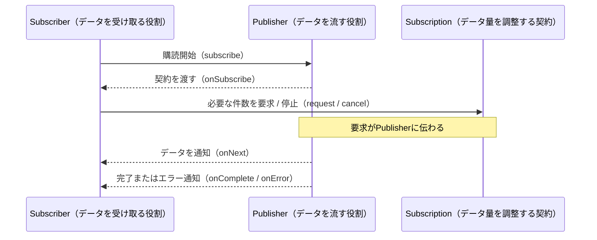

## はじめに <!-- omit in toc -->

**Project Reactor**は**Javaでリアクティブプログラミングを実現するためのライブラリ**です。

Webフレームワークの[Spring WebFlux](https://docs.spring.io/spring-framework/reference/web/webflux/new-framework.html)でも利用されており、Javaでリアクティブシステムを構築するための重要なライブラリです。

一方で、これまでProject Reactorを利用したシステムで開発を行う機会がありましたが、私の周りも含めてProject Reactorで実装したコードの理解に苦戦することが多かったです。

苦戦する要因として、リアクティブプログラミングの考え方が、私たちが慣れ親しんだ構造化プログラミング、オブジェクト指向プログラミングとは大きく異なる点や、Project Reactorを学ぶための資料が少ないことが挙げられると考えています。

リアクティブプログラミングの概念を知らない方にとっては、**「Project Reactorのライブラリで何が行われるのか」、「Project Reactorで実装したコードの処理順序」などがわかりづらい**と感じるのではないでしょうか。

また、現状だと、Project Reactorについて日本語で解説している記事や動画は限られています。
リファレンスガイドである[**Reactor 3 Reference Guide**](https://projectreactor.io/docs/core/3.5.15/reference/index.html)は非常に充実した内容ですが、Project Reactorを初めて学ぶ方にとっては、内容が難しく感じるかもしれません。

本記事では、Reactor 3 Reference Guideの内容を理解するための基礎知識を身につけることを目的として、**Project Reactorの基本的な概念や使い方についてまとめて**みました。
Project Reactorに初めて触れる方々、難しいと感じる方々にとって、本記事が少しでも理解の助けになれば幸いです。

### 想定読者 <!-- omit in toc -->

本記事ではWebフレームワークのSpring WebFlux等でProject Reactorを利用しており、基本的な概念や使い方を理解したい方を想定読者としています。（Spring WebFluxそのものについては今回扱いません）

ただし、前提知識として、以下の内容を理解していることが望ましいです。

- Java8以降で採用されている、ラムダ式、StreamAPI等、関数型プログラミングの考え方を理解している
- Junit5などのテストフレームワークを利用したユニットテストの経験がある

本記事のサンプルコードを理解するにあたり、ラムダ式の構文、StreamAPIの中間操作や終端操作など知識が必要ですが、これらの内容については本記事では説明しないため、その点はご了承ください。

### サンプルコード <!-- omit in toc -->

本記事で紹介するサンプルコードは、[ebichan88/reactor-sample-project](https://github.com/ebichan88/reactor-sample-project)のGitHubリポジトリで公開しています。

#### バージョン情報 <!-- omit in toc -->

| ツール / ライブラリ | バージョン |
| --- | --- |
| Java | 21 |
| Gradle | 8.5 |
| Reactor Core | 3.5.23 |
| Reactor BOM | 2025.0.4 |

#### サブプロジェクト一覧 <!-- omit in toc -->

| サブプロジェクト | 説明 |
| --- | --- |
| `reactor-kitchen` | Project Reactor を使ったキッチン（料理注文）シミュレーションアプリ |
| `reactor-demo` | Reactor の各種 Operator（map / flatMap / filter / retry など）のデモと動作確認テスト |
| `thread-demo` | Java のスレッド・並行処理に関するデモ |

## 目次 <!-- omit in toc -->

- [第1章 Project Reactorを理解するための基礎知識](#第1章-project-reactorを理解するための基礎知識)
  - [1.1 リアクティブプログラミングとは](#11-リアクティブプログラミングとは)
    - [1.1.1 リアクティブシステム](#111-リアクティブシステム)
    - [1.1.2 リアクティブプログラミング](#112-リアクティブプログラミング)
    - [1.1.3 データの流れを宣言的に記述するとは？ - Excelの数式を例に -](#113-データの流れを宣言的に記述するとは---excelの数式を例に--)
    - [1.1.4 Reactive Streamsによるデータの流れ](#114-reactive-streamsによるデータの流れ)
    - [1.1.5 サイゼリヤの紙注文方式で考える Reactive Streams](#115-サイゼリヤの紙注文方式で考える-reactive-streams)
    - [1.1.6 リアクティブプログラミングのスレッドの効率について](#116-リアクティブプログラミングのスレッドの効率について)
  - [1.2 ノンブロッキングとは](#12-ノンブロッキングとは)
    - [1.2.1 ノンブロッキングと非同期処理の違い](#121-ノンブロッキングと非同期処理の違い)
    - [1.2.2 並列ブロッキング（スレッドプール）とノンブロッキング（Reactor）の実行時間比較](#122-並列ブロッキングスレッドプールとノンブロッキングreactorの実行時間比較)
  - [1.3 バックプレッシャーとは](#13-バックプレッシャーとは)
    - [1.3.1 バックプレッシャーによるデータ流量の制御](#131-バックプレッシャーによるデータ流量の制御)
    - [1.3.2 サイゼリヤの注文で考えるバックプレッシャー](#132-サイゼリヤの注文で考えるバックプレッシャー)
  - [1.4 第1章のまとめ](#14-第1章のまとめ)
- [第2章 Project Reactorの導入](#第2章-project-reactorの導入)
- [第3章 Project Reactorの基本概念](#第3章-project-reactorの基本概念)
  - [3.1 Reactive Streamsで定義されたAPIコンポーネント](#31-reactive-streamsで定義されたapiコンポーネント)
    - [3.1.1 Publisher](#311-publisher)
    - [3.1.2 Subscriber](#312-subscriber)
    - [3.1.3 Subscription](#313-subscription)
  - [3.2 APIコンポーネントを実装したProject Reactorのクラス](#32-apiコンポーネントを実装したproject-reactorのクラス)
  - [3.3 Reactorの処理フローについて](#33-reactorの処理フローについて)
    - [3.3.1 Reactorの処理は「定義」と「実行」に分かれる](#331-reactorの処理は定義と実行に分かれる)
    - [3.3.2 「実行」はsubscribeのタイミングで行われる](#332-実行はsubscribeのタイミングで行われる)
  - [3.4 第3章のまとめ](#34-第3章のまとめ)
- [第4章 FluxとMono](#第4章-fluxとmono)
  - [4.1 FluxとMonoとは](#41-fluxとmonoとは)
  - [4.2 Operatorとは](#42-operatorとは)
    - [4.2.1 Operatorの種類を知るためには](#421-operatorの種類を知るためには)
    - [4.2.2 マーブル図の読み方](#422-マーブル図の読み方)
    - [4.2.3 新規シーケンス作成系Operator](#423-新規シーケンス作成系operator)
    - [4.2.4 変換系Operator](#424-変換系operator)
    - [4.2.5 フィルタリング系Operator](#425-フィルタリング系operator)
    - [4.2.6 結合系Operator](#426-結合系operator)
    - [4.2.7 時間制御系Operator](#427-時間制御系operator)
    - [4.2.8 エラーハンドリング系Operator](#428-エラーハンドリング系operator)
    - [4.2.9 デバッグ・副作用系Operator](#429-デバッグ副作用系operator)
  - [4.3 第4章のまとめ](#43-第4章のまとめ)
- [第5章 Project Reactorの高度な機能と概念](#第5章-project-reactorの高度な機能と概念)
  - [5.1 ReactorにおけるContext](#51-reactorにおけるcontext)
    - [5.1.1 Contextとは](#511-contextとは)
    - [5.1.2 Contextの利用例](#512-contextの利用例)
    - [5.1.3 Contextの詳細について](#513-contextの詳細について)
  - [5.2 第5章のまとめ](#52-第5章のまとめ)
- [第6章 Project Reactorのユニットテスト](#第6章-project-reactorのユニットテスト)
  - [6.1 ユニットテストの導入](#61-ユニットテストの導入)
  - [6.2 StepVerifierの基本](#62-stepverifierの基本)
    - [6.2.1 正常系のテスト](#621-正常系のテスト)
    - [6.2.2 異常系のテスト](#622-異常系のテスト)
    - [6.2.3 時間を扱うテスト](#623-時間を扱うテスト)
  - [6.3 テストの詳細について](#63-テストの詳細について)
  - [6.4 第6章のまとめ](#64-第6章のまとめ)
- [おわりに](#おわりに)
- [参考文献](#参考文献)

## 第1章 Project Reactorを理解するための基礎知識

まずは、Project Reactorのライブラリの特徴を理解するところから始めます。

Project Reactorの概要について、[Reactor 3 Reference Guide](https://projectreactor.io/docs/core/3.5.15/reference/index.html)の内容を引用します。

> Reactor is a fully non-blocking reactive programming foundation for the JVM, with efficient demand management (in the form of managing “backpressure”).　[^10]

[^10]: [Reactor 3 Reference Guide 2.1. Introducing Reactor](https://projectreactor.io/docs/core/3.5.15/reference/index.html#getting-started-introducing-reactor)

Google翻訳で和訳すると次の通りです。

> **Reactorは、JVM向けの完全ノンブロッキングなリアクティブプログラミング基盤であり、効率的な需要管理（「バックプレッシャー」の管理という形）を備えています。**

・・この説明だけだと正直よくわからないですよね？（少なくとも私にはわかりませんでした・・。）

技術書の解説に知らない用語が出てきて理解の妨げになることはエンジニアなら誰しも経験すると思いますが、Project Reactorも同様に、まずは説明の中で登場した3つのキーワードを理解することが重要です。

- **リアクティブプログラミング**
- **ノンブロッキング**
- **バックプレッシャー**

本章ではこの3つのキーワードの説明を通じて、Project Reactorを理解するための基礎知識を身につけることを目指します。

### 1.1 リアクティブプログラミングとは

**リアクティブプログラミング**の前に、まずは**リアクティブシステム**の概念について説明します。

#### 1.1.1 リアクティブシステム

リアクティブシステムについて、[リアクティブ宣言](https://www.reactivemanifesto.org/ja/)で策定されている4つの特徴を紹介します。

1. **即応性 (Responsive)**
   1. 迅速で一貫した応答時間
   2. 問題を素早く検出し、効果的に対処可能
2. **耐障害性 (Resilient)**
   1. 障害が発生しても即応性を維持
   2. コンポーネントを隔離し、障害発生時にシステム全体への影響を抑える
3. **弾力性 (Elastic)**
   1. 負荷に応じて自動でスケーリング
4. **メッセージ駆動 (Message Driven)**
   1. 非同期メッセージパッシングを使用してコンポーネント間の通信を行い、下記を実現
      1. 疎結合性
      2. 隔離性
      3. 位置透過性
   2. 必要に応じて、バックプレッシャーを使用して、システムの過負荷を防止
   3. ノンブロッキング通信により、システムのオーバヘッドを抑制

上記の特徴を備えたシステムの例として、LINE、Chatwork[^15]など、マイクロサービスアーキテクチャやリアルタイムデータストリーミングを採用しているシステムが挙げられます。

[^15]: [Chatwork、LINE、Netflixが進めるリアクティブシステムとは？　メリットは？　実現するためのライブラリは？ - RPはどのようなアプリケーションで使われているのか](https://atmarkit.itmedia.co.jp/ait/articles/1703/16/news023.html)

リアクティブシステムは、ミリ秒の応答時間、高い可用性、大量リクエストの処理能力等、リアルタイム性が求められるシステムを構築するために必要な**アーキテクチャの設計原則**といえます。

この4つの特徴を持つシステムを実現するためのアプローチの一つとして、**リアクティブプログラミング**が存在します。

#### 1.1.2 リアクティブプログラミング

リアクティブプログラミングは、**データの流れ（ストリーム）とその変化に対する処理を、宣言的に記述する**プログラミングスタイルです。

#### 1.1.3 データの流れを宣言的に記述するとは？ - Excelの数式を例に -

データの流れを宣言する例として、[2015年に備えて知っておきたいリアクティブアーキテクチャの潮流](https://qiita.com/hirokidaichi/items/9c1d862099c2e12f5b0f#エクセルとリアクティブプログラミング)に記載されているExcelの数式の説明を紹介します。

Javaで実装されたコードの例を見てみましょう。

```java
int a = b + c;
```

上記の処理はその瞬間の値を扱っており、`b`や`c`が後から変わっても`a`は変わりません。

一方、Excelで例えば`A1`セルに **`=B1+C1`** という数式を入力したとします。


この場合、`B1`、`C1`セルの値が変わると、**再計算の処理を記述する必要がなく、`A1`セルの値も自動的に更新されます。**

構造化プログラミングのような命令したい処理を順番通りに記述する言語とは異なり、リアクティブプログラミングはデータの流れと変化に対する処理を宣言的に記述するスタイルが特徴です。

#### 1.1.4 Reactive Streamsによるデータの流れ

リアクティブプログラミングは **データの流れ（ストリーム）** を扱うと説明しました。

このデータの流れを非同期ストリームをバックプレッシャー付きで扱うための仕様として、**Reactive Streams**[^20]が存在します。

[^20]: [reactive-streams-jvm Reactive Streams](https://github.com/reactive-streams/reactive-streams-jvm#reactive-streams)

Reactive Streamsでは、非同期ストリームをバックプレッシャー付きで扱うために、主に次のAPIコンポーネントを定義しています。

- **Publisher** : **データを流す**役割を担うコンポーネント
- **Subscriber** : **データを受け取る**役割を担うコンポーネント
- **Subscription** : SubscriberがPublisher に対して「何件受け取るか(request)」「購読を止めるか(cancel)」を制御するための**データ量を調整する契約**の役割を担うコンポーネント

それぞれの関係性を図で示すと次の通りです。



#### 1.1.5 サイゼリヤの紙注文方式で考える Reactive Streams

少し抽象的なので、一例として導入されていたサイゼリヤの紙注文方式[^25]で置き換えてみます。

[^25]: 2026年現在はスマホで番号を入力して注文する方式のため、紙注文方式のイメージが湧かない方は[こちら](https://togetter.com/li/2041203)をご覧ください。

| APIコンポーネント | 役割 | 登場人物 |
| :----------- | :------------ | :------------ |
| Publisher | データを流す役割 | 店（厨房） |
| Subscriber | データを受け取る役割 | 客 |
| Subscription | データ量を調整する契約の役割 | 注文票 |

##### イメージ図  <!-- omit in toc -->


##### 1. **客：「注文お願いします」と伝える** <!-- omit in toc -->

客が店に「注文お願いします」と伝えることが、 **`Subscriber`が`Publisher#subscribe`を実行して購読開始を伝える** ことに相当します。

##### 2. **店：注文票を渡す** <!-- omit in toc -->

店が客に注文票を渡すことが、 **`Publisher`が`Subscriber#onSubscribe`に対して契約（`Subscription`）を渡す** ことに相当します。

##### 3. **客：2皿注文する** <!-- omit in toc -->

客が注文票に「前菜を2皿お願いします」と記入することが、 **`Subscriber`が`Subscription#request(2)`を実行して、必要な件数を要求する** ことに相当します。

##### 4. **店：2皿提供する** <!-- omit in toc -->

店が注文票に記載された内容を確認し、前菜を2皿提供することが、 **`Publisher`が`Subscriber#onNext`を実行して、データを通知する** ことに相当します。

##### 5. **客：食べ終えたら追加で注文する** <!-- omit in toc -->

客が前菜を食べ終えた後、注文票に「メインを1皿お願いします」と記入することが、 **`Subscriber`が`Subscription#request(1)`を実行して、追加で必要な件数を要求する** ことに相当します。

##### 6. **店：1皿提供する** <!-- omit in toc -->

店が注文票に記載された内容を確認し、メインを1皿提供することが、 **`Publisher`が`Subscriber#onNext`を実行して、データを通知する** ことに相当します。

##### 7. **客：もう不要なら注文を止める** <!-- omit in toc -->

客が注文票に「もう不要です」と記入することが、 **`Subscriber`が`Subscription#cancel`を実行して、購読を止める** ことに相当します。

#### 1.1.6 リアクティブプログラミングのスレッドの効率について

従来のプログラミングにおいて、HTTPリクエストやDBアクセスなどのI/O操作が発生すると、 **その処理が完了するまでスレッドが待機（ブロッキング）** します。

その結果、待機している間スレッドは他の処理に使えず、**多数のリクエストが同時に発生した場合にスレッドが枯渇しやすく**なります。

一方、Project Reactorのようなリアクティブプログラミングでは、**ノンブロッキング**と**バックプレッシャー**を組み合わせることで、効率的にデータを扱えます。

**ノンブロッキング**と**バックプレッシャー**の具体的な仕組みについては以降の章で説明します。

### 1.2 ノンブロッキングとは

ノンブロッキング、及びブロッキングは次の通りに定義[^30] [^40] [^50]できます。

[^30]: [リアクティブ宣言 - ノンブロッキング](https://www.reactivemanifesto.org/ja/glossary#Non-Blocking)
[^40]: [GeeksforGeeks - Blocking and Nonblocking IO in Operating System](https://www.geeksforgeeks.org/operating-systems/blocking-and-nonblocking-io-in-operating-system/)
[^50]: [「分かりそう」で「分からない」でも「分かった」気になれるIT用語辞典 - ブロッキングI/O](https://wa3.i-3-i.info/word1618.html)

- **ブロッキング**：I/O操作が完了するまでスレッドが待機する
- **ノンブロッキング**：I/O操作の完了を待たずにスレッドの制御が戻る

また、ここで記載している**I/O操作**とは主に次の内容を指します。

- DBアクセス
- ファイルの読み書き
- HTTPリクエストの送受信

#### 1.2.1 ノンブロッキングと非同期処理の違い

ノンブロッキングの説明を見ると非同期処理を思い浮かべる方もいると思います。
ですが、非同期処理とノンブロッキング概要は次のように区別されます。[^60] [^70]

- 非同期処理：**呼び出し元が結果を待たずに次の処理へ進める実行方式
  - 結果の受け取り方として、コールバックやFutureなどを利用する**
- ノンブロッキング：**I/O操作の完了を待たずにスレッドの制御が戻る**

非同期処理はタスクの**呼び出し方法**について、ノンブロッキングはタスクの**I/O待ち中にスレッドを解放するかどうか**に着目した概念です。

両者は密接に関連していますが、「呼び出しが非同期である」ことと「タスク自身がノンブロッキングである」ことは別の話です。

非同期処理は呼び出しが即時に戻るため、複数のタスクを並列に投入できます。
ただし、実行するタスクがブロッキングであれば、I/O待ち中もスレッドを占有するため、同時に動かせるタスク数はスレッド数に制限されます。

[^60]: [GeeksforGeeks - Difference between Asynchronous and Non-blocking](https://www.geeksforgeeks.org/node-js/difference-between-asynchronous-and-non-blocking/)
[^70]: [Zenn - 同期・非同期 / ブロッキング・ノンブロッキング ~ そろそろ完全に理解する ~](https://zenn.dev/su8/articles/f8ece341f4a7bb)

#### 1.2.2 並列ブロッキング（スレッドプール）とノンブロッキング（Reactor）の実行時間比較

違いを説明するために、次のタスクを処理する例を考えてみましょう。

| タスク数 | スレッド数 |
| :------- | :------------- |
| 10（各1秒のI/O待ちを想定） | 4 |

上記のタスクを**ブロッキング**で処理する場合と、**ノンブロッキング**で処理する場合で、サンプルコードの実行結果を比較します。

サンプルコードとしては複雑な構成のため、コードの解説と実行結果を見て、両者の違いを理解していただければと思います。
コードは[こちら](https://github.com/ebichan88/reactor-sample-project/tree/main/thread-demo)からでも参照できます。

<details><summary>サンプルコード</summary>

```java
package demo;

import java.time.Duration;
import java.time.Instant;
import java.util.ArrayList;
import java.util.Collections;
import java.util.List;
import java.util.Set;
import java.util.concurrent.ArrayBlockingQueue;
import java.util.concurrent.ConcurrentHashMap;
import java.util.concurrent.CountDownLatch;
import java.util.concurrent.ExecutionException;
import java.util.concurrent.ThreadPoolExecutor;
import java.util.concurrent.TimeUnit;

import reactor.core.publisher.Flux;
import reactor.core.publisher.Mono;
import reactor.core.scheduler.Scheduler;
import reactor.core.scheduler.Schedulers;

/**
 * スレッド効率の比較デモ。
 *
 * 「並列度」が同じでも、ブロッキングは I/O の間もスレッドを占有し続けるため
 * タスク数と同数のスレッドが必要になる。
 * 一方ノンブロッキングは少数の共有スレッドで多数の I/O 待ちを同時に捌ける。
 *
 * 2 つのバリアントで比較する:
 * 1. BLOCKING（並列） : タスク数と同数のスレッドを生成して並列処理
 * 2. NON-BLOCKING : 少数（CPU コア数程度）のスレッドで全タスクを並列処理
 */
public class ThreadDemo {

    /** 10 件のタスク（各 1 秒の I/O 待ちを想定） */
    static final List<String> TASKS;
    static {
        List<String> list = new ArrayList<>();
        for (int i = 1; i <= 10; i++) {
            list.add("タスク-" + String.format("%02d", i));
        }
        TASKS = Collections.unmodifiableList(list);
    }
    /** 各タスクの I/O 待ち時間（ミリ秒） */
    static final int TASK_MILLIS = 1_000;
    /** 両フェーズで共通のスレッド数 */
    static final int POOL_SIZE = 4;

    public static void main(String[] args) throws InterruptedException, ExecutionException {
        phase1BlockingConcurrent(); // フェーズ1: ブロッキング・並列のデモ
        phase2NonBlocking(); // フェーズ2: ノンブロッキング（Reactor）のデモ
    }

    // ─────────────────────────────────────────────────────────────
    // フェーズ1: ブロッキング（POOL_SIZE スレッド固定）
    // I/O 待ち中もスレッドを占有するため、実行できるタスクは常に POOL_SIZE 個だけ。
    // 残りはキューで待機 → 合計時間 = ceil(タスク数 / POOL_SIZE) × TASK_MILLIS
    // ─────────────────────────────────────────────────────────────
    static void phase1BlockingConcurrent() throws InterruptedException, ExecutionException {
        header("BLOCKING: スレッド数=" + POOL_SIZE + "、タスク数=" + TASKS.size());
        Set<String> threads = ConcurrentHashMap.newKeySet();
        CountDownLatch latch = new CountDownLatch(TASKS.size());
        Instant start = Instant.now();

        try (ThreadPoolExecutor pool = new ThreadPoolExecutor(
                POOL_SIZE, POOL_SIZE, 0L, TimeUnit.MILLISECONDS, new ArrayBlockingQueue<>(TASKS.size()))) {

            for (String task : TASKS) {
                int active = pool.getActiveCount(); // 現在実行中のスレッド数
                int queued = pool.getQueue().size(); // キューに待機中のタスク数
                System.out.printf("[main] submit: %s  (現在実行中のスレッド数=%d, キューに待機中のタスク数=%d)%n", task, active, queued);
                // タスクをスレッドプールに投入し、空きスレッドがあれば即時実行、無ければキューに入り後で実行される
                pool.submit(() -> {
                    System.out.printf("[%s] 開始: %s%n", Thread.currentThread().getName(), task);
                    threads.add(Thread.currentThread().getName());
                    try {
                        Thread.sleep(TASK_MILLIS); // I/O 待ち中もスレッドを占有
                    } catch (InterruptedException e) {
                        Thread.currentThread().interrupt();
                    }
                    System.out.printf("[%s] 完了: %s%n", Thread.currentThread().getName(), task);
                    latch.countDown(); // タスク完了をカウントダウン
                });
            }
            latch.await(); // 全タスクの完了を待機
        }

        System.out.printf("  使用スレッド数 : %d%n", threads.size());
        System.out.printf("  合計時間        : %d ms  ※ タスクは POOL_SIZE=%d ごとに直列処理されます（合計 %d 件）%n%n",
                elapsed(start), POOL_SIZE, TASKS.size());
    }

    // ─────────────────────────────────────────────────────────────
    // フェーズ2: ノンブロッキング（Reactor、スレッド数を POOL_SIZE に固定）
    // delayElement は I/O 待ち中にスレッドを解放するため、
    // POOL_SIZE スレッドで全タスクをほぼ同時に処理できる。
    // ─────────────────────────────────────────────────────────────
    static void phase2NonBlocking() throws InterruptedException {
        header("NON-BLOCKING（Reactor）: スレッド数=" + POOL_SIZE + "、タスク数=" + TASKS.size());
        Set<String> threads = ConcurrentHashMap.newKeySet();
        CountDownLatch latch = new CountDownLatch(TASKS.size());
        Instant start = Instant.now();

        // ブロッキングと同じ POOL_SIZE スレッド数に固定したスケジューラを使用
        Scheduler scheduler = Schedulers.newParallel("reactor-pool", POOL_SIZE);

        Flux.fromIterable(TASKS)
                .flatMap(name -> Mono.just(name)
                        .doOnSubscribe(s -> System.out.printf("[%s] 開始: %s%n", Thread.currentThread().getName(), name))
                        .delayElement(Duration.ofMillis(TASK_MILLIS), scheduler) // 待機中はスレッドを解放
                        .doOnNext(n -> {
                            System.out.printf("[%s] 完了: %s%n", Thread.currentThread().getName(), n);
                            threads.add(Thread.currentThread().getName());
                            latch.countDown(); // タスク完了をカウントダウン
                        }))
                .subscribe();
        latch.await(); // 全タスクの完了を待機
        scheduler.dispose(); // スケジューラをクリーンアップ

        System.out.printf("  使用スレッド数 : %d%n", threads.size());
        System.out.printf("  合計時間        : %d ms  ※ I/O 待ち中にスレッドを解放するため全タスクが並列完了%n", elapsed(start));
    }

    // ─────────────────────────────────────────────────────────────
    // ユーティリティ
    // ─────────────────────────────────────────────────────────────
    static long elapsed(Instant start) {
        return Duration.between(start, Instant.now()).toMillis();
    }

    static void header(String title) {
        System.out.println("═".repeat(60));
        System.out.println("  " + title);
        System.out.println("═".repeat(60));
    }
}
```

</details>

##### サンプルコード（並列ブロッキング） <!-- omit in toc -->

サンプルコードのうち、並列ブロッキング処理を抜粋したコードです。

```java
static void phase1BlockingConcurrent() throws InterruptedException,ExecutionException {
    header("BLOCKING: スレッド数=" + POOL_SIZE + "、タスク数=" + TASKS.size());
    Set<String> threads = ConcurrentHashMap.newKeySet();
    CountDownLatch latch = new CountDownLatch(TASKS.size());
    Instant start = Instant.now();
    try (ThreadPoolExecutor pool = new ThreadPoolExecutor(
            POOL_SIZE, POOL_SIZE, 0L, TimeUnit.MILLISECONDS, new ArrayBlockingQueue<>(TASKS.size()))) {
        for (String task : TASKS) {
            int active = pool.getActiveCount(); // 現在実行中のスレッド数
            int queued = pool.getQueue().size(); // キューに待機中のタスク数
            System.out.printf("[main] submit: %s  (現在実行中のスレッド数=%d, キューに待機中のタスク数=%d)%n", task, active, queued);
            // タスクをスレッドプールに投入し、空きスレッドがあれば即時実行、無ければキューに入り後で実行される
            pool.submit(() -> {
                System.out.printf("[%s] 開始: %s%n", Thread.currentThread().getName(), task);
                threads.add(Thread.currentThread().getName());
                try {
                    Thread.sleep(TASK_MILLIS); // I/O待ちを“疑似的に再現”するためにスレッドをブロック
                } catch (InterruptedException e) {
                    Thread.currentThread().interrupt();
                }
                System.out.printf("[%s] 完了: %s%n", Thread.currentThread().getName(), task);
                latch.countDown(); // タスク完了をカウントダウン
            });
        }
        latch.await(); // 全タスクの完了を待機
    }
    System.out.printf("  使用スレッド数 : %d%n", threads.size());
    System.out.printf("  合計時間        : %d ms  ※ タスクは POOL_SIZE=%d ごとに直列処理されます（合計 %d 件）%n%n",
            elapsed(start), POOL_SIZE, TASKS.size());
}
```

##### サンプルコードの解説（並列ブロッキング） <!-- omit in toc -->

本コードでは、スレッドプールを用いてタスクを並列実行しています。

各タスクは `Thread.sleep` によって1秒間の待機（I/O待ちを模擬）を行いますが、この間**スレッドは占有された状態を維持**します。
そのため、同時に実行できるタスク数はスレッド数に制限され、それを超えたタスクはキューに積まれて待機します。

実行結果からも分かる通り、スレッド数が4の場合は4件ずつしか処理が進まず、全体として直列的に処理されます。

##### サンプルコードの実行結果（並列ブロッキング） <!-- omit in toc -->

```bash
════════════════════════════════════════════════════════════
  BLOCKING: スレッド数=4、タスク数=10
════════════════════════════════════════════════════════════
[main] submit: タスク-01  (現在実行中のスレッド数=0, キューに待機中のタスク数=0)
[main] submit: タスク-02  (現在実行中のスレッド数=1, キューに待機中のタスク数=0)
[pool-1-thread-1] 開始: タスク-01
[main] submit: タスク-03  (現在実行中のスレッド数=2, キューに待機中のタスク数=0)
[pool-1-thread-2] 開始: タスク-02
[main] submit: タスク-04  (現在実行中のスレッド数=3, キューに待機中のタスク数=0)
[pool-1-thread-3] 開始: タスク-03
[main] submit: タスク-05  (現在実行中のスレッド数=4, キューに待機中のタスク数=0)
[main] submit: タスク-06  (現在実行中のスレッド数=4, キューに待機中のタスク数=1)
[main] submit: タスク-07  (現在実行中のスレッド数=4, キューに待機中のタスク数=2)
[main] submit: タスク-08  (現在実行中のスレッド数=4, キューに待機中のタスク数=3)
[main] submit: タスク-09  (現在実行中のスレッド数=4, キューに待機中のタスク数=4)
[main] submit: タスク-10  (現在実行中のスレッド数=4, キューに待機中のタスク数=5)
[pool-1-thread-4] 開始: タスク-04
[pool-1-thread-2] 完了: タスク-02
[pool-1-thread-3] 完了: タスク-03
[pool-1-thread-1] 完了: タスク-01
[pool-1-thread-1] 開始: タスク-06
[pool-1-thread-2] 開始: タスク-05
[pool-1-thread-3] 開始: タスク-07
[pool-1-thread-4] 完了: タスク-04
[pool-1-thread-4] 開始: タスク-08
[pool-1-thread-1] 完了: タスク-06
[pool-1-thread-2] 完了: タスク-05
[pool-1-thread-3] 完了: タスク-07
[pool-1-thread-1] 開始: タスク-09
[pool-1-thread-2] 開始: タスク-10
[pool-1-thread-4] 完了: タスク-08
[pool-1-thread-1] 完了: タスク-09
[pool-1-thread-2] 完了: タスク-10
  使用スレッド数 : 4
  合計時間        : 3026 ms  ※ タスクは POOL_SIZE=4 ごとに直列処理されます（合計 10 件）
```

##### サンプルコード（ノンブロッキング処理） <!-- omit in toc -->

サンプルコードのうち、ノンブロッキング処理を抜粋したコードです。

```java
static void phase2NonBlocking() throws InterruptedException {
    header("NON-BLOCKING（Reactor）: スレッド数=" + POOL_SIZE + "、タスク数=" + TASKS.size());
    Set<String> threads = ConcurrentHashMap.newKeySet();
    CountDownLatch latch = new CountDownLatch(TASKS.size());
    Instant start = Instant.now();
    // ブロッキングと同じ POOL_SIZE スレッド数に固定したスケジューラを使用
    Scheduler scheduler = Schedulers.newParallel("reactor-pool", POOL_SIZE);
    Flux.fromIterable(TASKS)
            .flatMap(name -> Mono.just(name)
                    .doOnSubscribe(s -> System.out.printf("[%s] 開始: %s%n", Thread.currentThread().getName(), name))
                    .delayElement(Duration.ofMillis(TASK_MILLIS), scheduler) // 待機中はスレッドを解放
                    .doOnNext(n -> {
                        System.out.printf("[%s] 完了: %s%n", Thread.currentThread().getName(), n);
                        threads.add(Thread.currentThread().getName());
                        latch.countDown(); // タスク完了をカウントダウン
                    }))
            .subscribe();
    latch.await(); // 全タスクの完了を待機
    scheduler.dispose(); // スケジューラをクリーンアップ
    System.out.printf("  使用スレッド数 : %d%n", threads.size());
    System.out.printf("  合計時間        : %d ms  ※ I/O 待ち中にスレッドを解放するため全タスクが並列完了%n", elapsed(start));
}
```

##### サンプルコードの解説（ノンブロッキング処理） <!-- omit in toc -->

サンプルコードでは、ReactorのFluxとMonoを用いて非同期処理を構成しています。（詳細は[第4章 FluxとMono](#第4章-fluxとmono)で説明します）
`flatMap` によって各タスクは非同期に処理され、`delayElement` によって1秒の遅延（I/O待ちを模擬）が発生します。

ブロッキング処理とは異なり、**待機中のスレッドは他のタスクの処理に再利用**されるため、スレッド数が同じであっても、全てのタスクをほぼ同時に進行させることができます。

その結果、全体の処理時間は大幅に短縮されています。

##### サンプルコードの実行結果（ノンブロッキング処理） <!-- omit in toc -->

```bash
════════════════════════════════════════════════════════════
  NON-BLOCKING（Reactor）: スレッド数=4、タスク数=10
════════════════════════════════════════════════════════════
[main] 開始: タスク-01
[main] 開始: タスク-02
[main] 開始: タスク-03
[main] 開始: タスク-04
[main] 開始: タスク-05
[main] 開始: タスク-06
[main] 開始: タスク-07
[main] 開始: タスク-08
[main] 開始: タスク-09
[main] 開始: タスク-10
[reactor-pool-1] 完了: タスク-01
[reactor-pool-3] 完了: タスク-03
[reactor-pool-4] 完了: タスク-04
[reactor-pool-2] 完了: タスク-02
[reactor-pool-2] 完了: タスク-06
[reactor-pool-2] 完了: タスク-10
[reactor-pool-1] 完了: タスク-05
[reactor-pool-1] 完了: タスク-09
[reactor-pool-3] 完了: タスク-07
[reactor-pool-4] 完了: タスク-08
  使用スレッド数 : 4
  合計時間        : 1185 ms  ※ I/O 待ち中にスレッドを解放するため全タスクが並列完了
```

##### ノンブロッキング処理と並列ブロッキング処理の実行時間の比較結果 <!-- omit in toc -->

| 処理方式 | 使用スレッド数 | 合計時間（ms） |
| :------- | :------------- | :-------------- |
| 並列ブロッキング処理 | 4 | 3026 |
| ノンブロッキング処理 | 4 | 1185 |

合計時間を見たらわかる通り、並列ブロッキング処理とノンブロッキング処理の両方で同じスレッド数を使用しているにもかかわらず、ノンブロッキング処理の方が約2.5倍速い結果となっています。

**並列ブロッキング処理**では、各タスクがI/O待ちの間もスレッドを占有するため、**同時に処理できるタスク数はスレッド数に制限**されます。
今回のコードの場合、タスク数がスレッド数を超えた分はキューに積まれて順番に処理されるため、全体の処理時間が長くなります。

一方、**ノンブロッキング処理**では、I/O待ちの間にスレッドが解放され、**他のタスクの処理に再利用**されます。
そのため、スレッド数が同じでも多くのタスクを同時に進行させることができ、全体の処理時間を短縮できます。

Project Reactorはノンブロッキングの仕組みによって、スレッドを効率的に使うことができます。

### 1.3 バックプレッシャーとは

ここまで、Project Reactorは**ノンブロッキング**によってスレッドを効率よく使えることを説明しました。

ただ、スレッド効率が良くても、**Publisher（データを流す役割）がSubscriber（受け取る側）の処理能力を超える速度でデータを流したらどうなるか**という問題は残ります。

例えば、

- Publisherが毎秒10000件のイベントを流す
- Subscriberが毎秒7500件のイベントしか処理できない

という状況では、受け取る側が処理しきれないデータが溜まり、

- メモリ使用量の増加
- キューの肥大化
- レイテンシ悪化
- 最悪システムダウン

につながる可能性があります。

この問題を防ぐ仕組みが **バックプレッシャー** です。

#### 1.3.1 バックプレッシャーによるデータ流量の制御

**バックプレッシャー**はストリーム要素の送信を制御するための仕組みで、**受け取る側が処理可能な量だけ、送る側に要求して流量を制御する**ことを指します。[^80]

[^80]: [Baeldung - Backpressure Mechanism in Spring WebFlux](https://www.baeldung.com/spring-webflux-backpressure)

Reactive Streamsでは、`Subscription#request(n)` を実行することで、　**「今は2件だけ送ってください」**　とSubscriberがPublisherに伝えています。

#### 1.3.2 サイゼリヤの注文で考えるバックプレッシャー

先ほどのサイゼリヤの例で考えてみます。
もし店（厨房）が、客が食べ終わっていないにも関わらず、

- パスタ10皿
- ピザ5枚
- ドリア3皿

を一気に運んできたら、テーブルは料理で溢れてしまいます。
これは、処理しきれない量のデータが流れてくる状態と同じです。

一方、客が

1. まず2皿だけ注文する
2. 食べ終わったら次を注文する

とできれば、無理なく処理できます。

つまり、**[1.1.4 Reactive Streamsによるデータの流れ](#114-reactive-streamsによるデータの流れ)の章で紹介した下記の内容は、まさにこのバックプレッシャーの例**でした。

>客が前菜を食べ終えた後、注文票に「メインを1皿お願いします」と記入することが、 SubscriberがSubscription#request(1)を実行して、追加で必要な件数を要求する ことに相当します。

### 1.4 第1章のまとめ

本章では[Reactor 3 Reference Guide](https://projectreactor.io/docs/core/3.5.15/reference/index.html)の内容に沿って、Project Reactorの理解に必要な**リアクティブプログラミング**、**ノンブロッキング**、**バックプレッシャー**について説明しました。

- **Project Reactor**
  - Javaでリアクティブプログラミングを実現するライブラリであり、ノンブロッキングとバックプレッシャーの両方をサポートしている
- **リアクティブプログラミング**
  - データの流れ（ストリーム）とその変化に対する処理を、宣言的に記述するプログラミングスタイル
  - ノンブロッキングとバックプレッシャーを組み合わせることで、効率的にデータを扱える
- **ノンブロッキング**
  - I/O待ちの間もスレッドを占有しないため、効率的にスレッドを利用できる
- **バックプレッシャー**
  - 受け取る側が処理可能な量だけ送る側に要求して、データの流量を制御する仕組み

次章では、Project Reactorの導入方法について説明します。

## 第2章 Project Reactorの導入

Project Reactorを導入するにあたり、Maven、Gradleなどのプロジェクトのビルドツールに依存関係を追加しましょう。

Gradleプロジェクトの場合、`build.gradle`に次の依存関係を追加することで、主要ライブラリである`reactor-core`を利用できます。

```gradle:build.gradle
dependencies {
    implementation platform('io.projectreactor:reactor-bom:2025.0.4')
    implementation 'io.projectreactor:reactor-core'
}
```

詳細は[Reactor 3 Reference GuideのGetting Reactor](https://projectreactor.io/docs/core/3.5.15/reference/index.html#getting)の章を参照してください。

## 第3章 Project Reactorの基本概念

第1章では、Reactive Streamsにおけるデータの流れやAPIコンポーネント（Publisher / Subscriber / Subscription）について説明しました。

本章では、それらの概念が**Project Reactorの中でどのように動くのか**を見ていきます。

### 3.1 Reactive Streamsで定義されたAPIコンポーネント

[1.1.4 Reactive Streamsによるデータの流れ](#114-reactive-streamsによるデータの流れ)でも説明しましたが、Reactive Streamsには次のAPIコンポーネントが存在します。

- **Publisher** : **データを流す**役割を担うコンポーネント
- **Subscriber** : **データを受け取る**役割を担うコンポーネント
- **Subscription** : SubscriberがPublisher に対して「何件受け取るか(request)」「購読を止めるか(cancel)」を制御するための**データ量を調整する契約**の役割を担うコンポーネント

まずは、これらのAPIコンポーネントの仕様について説明します。

#### 3.1.1 Publisher

データを流す役割を担うAPIコンポーネントです。

```java
public interface Publisher<T> {
    public void subscribe(Subscriber<? super T> s);
}
```

- `subscribe`メソッド
  - Subscriberを引数に取り、データの流れを開始するためのメソッド
  - Subscriberは、Publisherからデータを受け取るためにこのメソッドを呼び出す必要がある

#### 3.1.2 Subscriber

データを受け取る役割を担うAPIコンポーネントです。

```java
public interface Subscriber<T> {
    public void onSubscribe(Subscription s);
    public void onNext(T t);
    public void onError(Throwable t);
    public void onComplete();
}
```

- `onSubscribe`メソッド
  - PublisherからSubscriptionを受け取るためのメソッド
  - Subscriberはこのメソッドで受け取ったSubscriptionを使って、Publisherに対してデータの要求や購読のキャンセルを行う
- `onNext`メソッド
  - データが正常に処理されたときに呼び出される
- `onError`メソッド
  - エラーが発生したときに呼び出される
- `onComplete`メソッド
  - データの処理が完了したときに呼び出される

#### 3.1.3 Subscription

SubscriberがPublisher に対して「何件受け取るか」「購読を止めるか」を制御するための契約の役割を担うAPIコンポーネントです。

```java
public interface Subscription {
    public void request(long n);
    public void cancel();
}
```

- `request`メソッド
  - SubscriberがPublisherに対して、次に受け取るデータの件数を要求するためのメソッド
- `cancel`メソッド
  - SubscriberがPublisherとの購読をキャンセルするためのメソッド

### 3.2 APIコンポーネントを実装したProject Reactorのクラス

Reactorでは、Reactive Streamsの仕様で定義されているPublisherインターフェースの実装として、**Flux**（0〜N件のデータ）と**Mono**（0〜1件のデータ）が提供されています。

**Flux**や**Mono**の具体的な使い方については[第4章 FluxとMono](#第4章-fluxとmono)で詳しく説明します。

### 3.3 Reactorの処理フローについて

本節から、Project Reactorを使ったコードを通じて、Reactorの処理フローについて説明します。

#### 3.3.1 Reactorの処理は「定義」と「実行」に分かれる

まずは、Project Reactorで`hello world!`を出力する簡単な例を見てみましょう。
コードは[こちら](https://github.com/ebichan88/reactor-sample-project/blob/main/reactor-demo/src/main/java/reactor/demo/App.java)からでも参照できます。

```java:hello world!を出力するサンプルコード
public static void main(String[] args) {
    // List から要素を順に発行するFluxを作成する
    Flux<String> flux = Flux.just("HELLO", " ", "WORLD", "!");  // [1]
    // Operator: 要素を順に小文字に変換する新しいFluxを作成する
    Flux<String> lowerCaseFlux = flux.map(String::toLowerCase); // [2]
    // subscribe: 購読開始して、Flux が値を発行すれば print が呼ばれる
    lowerCaseFlux.subscribe(System.out::print);                 // [3]
}
```

```text:実行結果
hello world!
```

Fluxやリアクティブプログラミングの概念を知らない状態で大雑把にコードを読み進めると、次のように解釈するかもしれません。

| 順序 | 説明 | コード |
| ----- | ----- | ----- |
| 1 | `"HELLO", " ", "WORLD", "!"`のリストのデータを宣言する | `Flux.just("HELLO", " ", "WORLD", "!");` |
| 2 | 小文字に変換する処理を実行する | `flux.map(String::toLowerCase)`[^90] |
| 3 | 小文字に変換されたリストのデータをコンソールに出力する | `lowerCaseFlux.subscribe(System.out::print);` |

[^90]: [java.util.stream.Stream#map](https://docs.oracle.com/javase/jp/8/docs/api/java/util/stream/Stream.html#:~:text=%E6%96%B0%E3%81%97%E3%81%84%E3%82%B9%E3%83%88%E3%83%AA%E3%83%BC%E3%83%A0-,map,-%3CR%3E%C2%A0Stream)をイメージされるかもしれませんが、本コードは[reactor.core.publisher.Flux#map](https://projectreactor.io/docs/core/release/api/reactor/core/publisher/Flux.html#map-java.util.function.Function-:~:text=that%20logs%20signals-,map,-public%20final%C2%A0%3CV)を使用しているため別物です。ただし、「各要素を1対1で変換する」という点では似ているため、関数型インターフェースに理解がある方はそれっぽく解読できるかもしれません。

しかし、Project Reactorの処理は **「定義」と「実行」に分かれている** ため、この解釈は正確ではありません。
わかりやすくするために、コードの中に下記のログを追加してみましょう。

- `map`の中で、変換前と変換後の値をログに出力する
  - `[flux.map]HELLO -> hello` 等
- `subscribe`の前に、購読開始のログを出力する
  - `=== starting subscribe ===`

```diff_java
public static void main(String[] args) {
    // List から要素を順に発行するFluxを作成する
    Flux<String> flux = Flux.just("HELLO", " ", "WORLD", "!");   // [1]
    // Operator: 要素を順に小文字に変換する新しいFluxを作成する
-    Flux<String> lowerCaseFlux = flux.map(String::toLowerCase); // [2]
+    Flux<String> lowerCaseFlux = flux.map(s -> {                // [2]
+        System.out.println("[flux.map]" + s + " -> " + s.toLowerCase());
+        return s.toLowerCase();
+    });
+    System.out.println("=== starting subscribe ===");
-    // subscribe: 購読開始して、Flux が値を発行すれば print が呼ばれる
+    // subscribe: 購読開始して、Flux が値を発行すれば println が呼ばれる
-    lowerCaseFlux.subscribe(System.out::print);                 // [3]
+    lowerCaseFlux.subscribe(System.out::println);               // [3]
}
```

>| 順序 | 説明 | コード |
>| ----- | ----- | ----- |
>| 1 | `"HELLO", " ", "WORLD", "!"`のリストのデータを宣言する | `Flux.just("HELLO", " ", "WORLD", "!");` |
>| 2 | 小文字に変換する処理を実行する | `flux.map(String::toLowerCase)`[^90] |
>| 3 | 小文字に変換されたリストのデータをコンソールに出力する | `lowerCaseFlux.subscribe(System.out::print);` |

もし、上記の解釈が正しいとすると、実行結果は次のようになるはずです。

```text:実行結果（想定）
[flux.map]HELLO -> hello
[flux.map]  ->  
[flux.map]WORLD -> world
[flux.map]! -> !
=== starting subscribe ===
hello
 
world
!
```

しかし、実際の実行結果は次の通りです。

```text:実際の実行結果
=== starting subscribe ===
[flux.map]HELLO -> hello
hello
[flux.map]  ->  
 
[flux.map]WORLD -> world
world
[flux.map]! -> !
!
```

`[flux.map]HELLO -> hello`のログが、`=== starting subscribe ===`の後に出力されていることから、`[2] flux.map(String::toLowerCase)`の処理は、コードに到達した時点では実行されていないことがわかります。

下記のコードは **Publisherがどのようにデータを処理するかを「定義」している** だけにすぎません。

```java
// List から要素を順に発行するFluxを作成する
Flux<String> flux = Flux.just("HELLO", " ", "WORLD", "!");  // [1]
// Operator: 要素を順に小文字に変換する新しいFluxを作成する
Flux<String> lowerCaseFlux = flux.map(String::toLowerCase); // [2]
```
  
では、`[2] flux.map(String::toLowerCase)`の処理はいつ「実行」されるのでしょうか？

#### 3.3.2 「実行」はsubscribeのタイミングで行われる

Publisherが「定義」した処理を実行するには、`Publisher#subscribe`を呼び出す必要があります。

```java
// subscribe: 購読開始して、Flux が値を発行すれば print が呼ばれる
lowerCaseFlux.subscribe(System.out::print);                 // [3]
```

`subscribe`が呼び出されると、これまでに「定義」してきたデータの流れが初めて実行されます。

ReactorはReactive Streamsの仕様に基づいて動作しているため、`subscribe()` を呼び出すと、内部では次のような流れで処理が進みます。

1. `Publisher#subscribe`が呼び出される
2. `Subscriber#onSubscribe`が呼ばれ、`Subscription`が渡される
3. `Subscriber`が`request(n)`を通じてデータを要求する
4. 要求された件数分だけ`onNext`が呼ばれる
5. すべてのデータが処理されると`onComplete`が呼ばれる（またはエラー時は `onError`）

今回のコードで使用している `subscribe(System.out::println)`[^100] は`Consumer<? super T>`（単一の入力引数を受け取って結果を返さない関数型インターフェース）を引数に取るオーバーロードされた `subscribe`メソッドで、**内部でSubscriberを生成し、購読開始時にrequest(Long.MAX_VALUE)（無制限要求）を行う** ため、結果として4件のデータ（`"HELLO", " ", "WORLD", "!"`）が一気に流れてくる動作になります。

[^100]: [Flux(reactor-core 3.8.5) - public final Disposable subscribe(java.util.function.Consumer<? super T> consumer)](https://projectreactor.io/docs/core/release/api/reactor/core/publisher/Flux.html#subscribe-org.reactivestreams.Subscriber-:~:text=public%20final%C2%A0Disposable%C2%A0subscribe(java.util.function.Consumer%3C%3F%20super%20T%3E%C2%A0consumer))

ここで改めて実行結果を見ると、

```text:実行結果
=== starting subscribe ===
[flux.map]HELLO -> hello
hello
[flux.map]  ->  
 
[flux.map]WORLD -> world
world
[flux.map]! -> !
!
```

- `"HELLO"` が流れる
  - `map`が実行され `"hello"` に変換される
  - `println`で出力される
- 以降、`" "`、`"WORLD"`、`"!"`の順に同様の処理が行われる

という流れで処理されていることがわかります。

:::note warn
[1.1.4 Reactive Streamsによるデータの流れ](#114-reactive-streamsによるデータの流れ)や[3.1 Reactive Streamsで定義されたAPIコンポーネント](#31-reactive-streamsで定義されたapiコンポーネント)の章でReactive Streamsについて解説しましたが、コードを見ての通り、ReactorではこれらをAPIで隠蔽しているため、最初は少し挙動わかりづらいと思います。
個人的な意見ですが、ここがReactorの難しいポイントだと感じています。
:::

### 3.4 第3章のまとめ

本章ではProject Reactorの基本概念について説明しました。

- **Reactive Streamsで定義されたAPIコンポーネント**
  - **Publisher** : データを流す役割
  - **Subscriber** : データを受け取る役割
  - **Subscription** : データ量を調整する契約の役割
- **Project Reactorのクラス**
  - **Flux** : 0〜N件のデータを扱うPublisherの実装
  - **Mono** : 0〜1件のデータを扱うPublisherの実装
- **Reactorの処理フロー**
  - 「定義」と「実行」に分かれている
  - `subscribe`のタイミングで「定義」した処理が「実行」される

次章では、Project Reactorの主要なAPIである**Flux**と**Mono**について、基本的な使い方やOperatorの例を説明します。

## 第4章 FluxとMono

### 4.1 FluxとMonoとは

**Flux**、**Mono**はReactive Streamsの仕様で定義されているPublisherインターフェースの実装クラスです。それぞれの違いは、扱うデータの件数です。

- **Flux** : 0〜N件のデータを扱うPublisherの実装
- **Mono** : 0〜1件のデータを扱うPublisherの実装

### 4.2 Operatorとは

**Operator**は単純な変換、フィルタリング、結合、時間制御、エラーハンドリング等、 **新しいPublisherを生成する処理（操作）** を指します。

`map`や`filter`などのJavaのStream APIの中間操作をイメージしてもらうとわかりやすいと思います。

ただし、Streamが同期的なコレクション処理であるのに対し、Reactorは非同期なデータストリームを扱う点が異なります。

[3.3.1 Reactorの処理は「定義」と「実行」に分かれる](#331-reactorの処理は定義と実行に分かれる)の章で紹介した下記のコードがOperatorに該当します。

```java
Flux<String> lowerCaseFlux = flux.map(String::toLowerCase); // [2]
```

また、**複数のOperatorをチェーンすることで、複雑なデータ処理の流れを宣言的に構築できる**という特徴があります。

```java:複数のOperatorをチェーンする例
userService.getFavorites(userId)
       .timeout(Duration.ofMillis(800)) 
       .onErrorResume(cacheService.cachedFavoritesFor(userId)) 
       .flatMap(favoriteService::getDetails) 
       .switchIfEmpty(suggestionService.getSuggestions())
       .take(5)
       .publishOn(UiUtils.uiThreadScheduler())
       .subscribe(uiList::show, UiUtils::errorPopup);
```

:::note warn
**Operator実行時の注意点**

[C.2. I Used an Operator on my Flux but it Doesn’t Seem to Apply. What Gives?](https://projectreactor.io/docs/core/3.5.15/reference/index.html#faq.chain)にも記載されていますが、多くのOperatorは新しいPublisherを返し、元のPublisherは変更されない（イミュータブル）ため、**Operatorを呼び出した後のPublisherを使用する必要がある**ことに注意してください。

次のコードのように、`map`の結果を新しいPublisherに代入せず、元のPublisherで`subscribe`を呼び出すと、Operator（`flux.map(String::toLowerCase)`）が適用されないため、元の大文字のまま出力されてしまいます。

```diff_java
public static void main(String[] args) {
    // List から要素を順に発行するFluxを作成する
    Flux<String> flux = Flux.just("HELLO", " ", "WORLD", "!");   // [1]
    // Operator: 要素を順に小文字に変換する新しいFluxを作成する
-    Flux<String> lowerCaseFlux = flux.map(String::toLowerCase); // [2]
+    flux.map(String::toLowerCase);                              // [2]
    // subscribe: 購読開始して、Flux が値を発行すれば print が呼ばれる
-    lowerCaseFlux.subscribe(System.out::print);                 // [3]
+    flux.subscribe(System.out::print);                          // [3]
}
```

```text:実行結果
HELLO WORLD!
```

:::

#### 4.2.1 Operatorの種類を知るためには

Reactorで扱えるOperatorは非常に多く、Operatorの種類を把握するのは大変です。

扱えるOperatorについて知りたい場合は、Reactor 3 Reference Guideの[Appendix A: Which operator do I need?](https://projectreactor.io/docs/core/3.5.15/reference/index.html#which-operator)や、[Flux API](https://projectreactor.io/docs/core/release/api/reactor/core/publisher/Flux.html)、[Mono API](https://projectreactor.io/docs/core/release/api/reactor/core/publisher/Mono.html)のJavadocを参照することで、各Operatorの詳細を確認できます。

#### 4.2.2 マーブル図の読み方

[4.2.1 Operatorの種類を知るためには](#421-operatorの種類を知るためには)の節で、Javadocについて触れましたが、ReactorのJavadocの内容を見ると見慣れない図が出てくると思います。


これは**マーブル図**と呼ばれるもので、データの流れや時間の経過、エラーの発生などを視覚的に表現した図です。

初見でマーブル図の記号を理解するのは難しいと思いますが、Reactor 3 Reference Guideの[Appendix B: How to read marble diagrams?](https://projectreactor.io/docs/core/3.5.15/reference/index.html#howtoReadMarbles)に、各記号の説明が記載されています。

マーブル図に記載されている内容を理解したい場合は、Reactor 3 Reference Guideを適宜参照しながら読み解いていくのが良いと思います。

#### 4.2.3 新規シーケンス作成系Operator

本節からは、Flux/Monoで利用できるOperatorをいくつかピックアップします。
まずは、**新規シーケンス作成系Operator** から見ていきましょう。

以降、Operatorのコードは[こちら](https://github.com/ebichan88/reactor-sample-project/blob/main/reactor-demo/src/main/java/reactor/demo/ReactorPlayground.java)からでも参照できます。

##### just <!-- omit in toc -->

指定した値を順に発行するFluxを生成するOperatorです。

```java
/**
 * 【Operator】just: 指定した値を順に発行する Flux を生成する。
 * 【入力】可変長引数 "A", "B", "C"
 * 【出力】"A", "B", "C"
 */
public Flux<String> demoJust() {
    return Flux.just("A", "B", "C");
}
```

##### fromIterable <!-- omit in toc -->

Iterable（List 等）の要素を順に発行するFluxを生成するOperatorです。

```java
/**
 * 【Operator】fromIterable: Iterable（List 等）の要素を順に発行する Flux を生成する。
 * 【入力】List.of("apple", "banana", "cherry")
 * 【出力】"apple", "banana", "cherry"
 */
public Flux<String> demoFromIterable() {
    return Flux.fromIterable(List.of("apple", "banana", "cherry"));
}
```

##### range <!-- omit in toc -->

開始値から指定件数の連続した整数を発行するFluxを生成するOperatorです。

```java
/**
 * 【Operator】range: 開始値から指定件数の連続した整数を発行する Flux を生成する。
 * 【入力】start=1, count=5
 * 【出力】1, 2, 3, 4, 5
 */
public Flux<Integer> demoRange() {
    return Flux.range(1, 5);
}
```

##### empty <!-- omit in toc -->

要素を発行せず、完了シグナルだけを発行するFluxを生成するOperatorです。

```java
/**
 * 【Operator】empty: 要素を持たない空の Flux を生成する。
 * 【入力】なし
 * 【出力】なし（完了するのみ）
 */
public Flux<String> demoEmpty() {
    return Flux.<String>empty();
}
```

##### defer <!-- omit in toc -->

Publisherを生成するためのラムダ式を引数に取り、subscribe()が呼ばれた瞬間にラムダ式が実行されるFluxを生成するOperatorです。

```java
/**
 * 【Operator】defer vs just: 評価タイミングの違いをコンソール出力で比較する。
 *
 * <ul>
 * <li>{@code Mono.defer}: ラムダは {@code subscribe()} が呼ばれた瞬間に実行される（遅延評価）。
 * 購読ごとに最新の値が得られる。
 * <li>{@code Mono.just}: 引数は {@code Mono.just(...)} が呼ばれた瞬間に評価される（即時評価）。
 * 何度購読しても生成時点の値が返る。
 * </ul>
 *
 * <p>
 * コンソール出力例（このメソッド呼び出しから 2000ms 以上経過後に subscribe した場合）:
 *
 * <pre>
 * defer : 2026-05-10T20:56:32.061554196  ← subscribe() 時点の時刻（新しい）
 * just  : 2026-05-10T20:56:30.048415802  ← Mono 生成時点の時刻（古い）
 * </pre>
 */
public void demoDeferMono() {
    // subscribe() 時に LocalDateTime.now() が評価される
    Mono<LocalDateTime> deferred = Mono.defer(() -> Mono.just(LocalDateTime.now()));
    // Mono.just() 呼び出し時点で LocalDateTime.now() が評価済みになる（即時評価）
    Mono<LocalDateTime> eager = Mono.just(LocalDateTime.now());
    try {
        Thread.sleep(2000); // 生成から購読までの時間差を明示するために待機
    } catch (InterruptedException e) {
        Thread.currentThread().interrupt();
    }
    // defer は subscribe 時（2000ms 後）に評価されるため、eager より後の時刻になる
    deferred.subscribe(time -> System.out.println("defer : " + time));
    // eager は Mono.just() 呼び出し時に評価済みのため、2000ms 前の時刻のまま
    eager.subscribe(time -> System.out.println("just  : " + time));
}
```

実行結果を見てもわかる通り、`defer`は`subscribe()`が呼ばれた瞬間に実行されるため、`just`よりも新しい時刻が出力されます。

```text:実行結果
defer : 2026-05-10T20:56:32.061554196
just  : 2026-05-10T20:56:30.048415802
```

#### 4.2.4 変換系Operator

次は、データを加工する**変換系Operator** を見ていきましょう。
[4.2.3 新規シーケンス作成系Operator](#423-新規シーケンス作成系operator)の節で紹介したOperatorと組み合わせて、作成したFluxを変換系Operatorで変換します。

##### map <!-- omit in toc -->

各要素を 1:1 で同期的に変換するOperatorです。

```java
/**
 * 【Operator】map: 各要素を 1:1 で同期的に変換する。
 * - 変換関数の戻り値は「値」（T → R）であり、Publisher ではない
 * - 必ず入力 1 件につき出力 1 件（1:1）
 * - 同期実行のため、元の順序が厳密に保証される
 * 【入力】Flux.range(1, 3) → 1, 2, 3
 * 【出力】"item-1", "item-2", "item-3"（順序保証）
 */
public Flux<String> demoMap() {
    return Flux.range(1, 3)
            .map(i -> "item-" + i); // T → R : 値を直接返す（1:1）
}
```

##### flatMap <!-- omit in toc -->

各要素をPublisherに変換し、内側Publisherが出す要素を1本のストリームへマージするOperatorです。順序は保証されません。

```java
/**
 * 【flatMap比較用】map で Publisher を返すと、出力は Publisher の Flux になる（Flux<Flux<String>>）。
 * - 変換関数の戻り値が Publisher なので、出力は Publisher の Flux になる（T → Publisher<R>）
 * - 1 件の入力から 1 件の出力（Publisher）になるため、全体としては 1:1 だが、出力の型は Flux<Flux<String>> となる
 * 【入力】Flux.just("A", "B", "C")
 * 【出力】Flux.just("A1", "A2"), Flux.just("B1", "B2"), Flux.just("C1", "C2")（順序保証）
 */
public Flux<Flux<String>> demoMap2() {
    return Flux.just("A", "B", "C")
            .map(s -> Flux.just(s + "1", s + "2"));
}

/**
 * 【Operator】flatMap: 各要素を非同期に Publisher へ展開し、結果をマージする（順序不保証）。
 * - 変換関数の戻り値は「Publisher」（T → Publisher<R>）であり、値ではない
 * - 1 件の入力から 0〜N 件の出力に展開できる（1:N）
 * - 内側の Publisher は並行購読されるため、到着順で結果がマージされ順序が不定になる
 * 【入力】Flux.just("A", "B", "C")
 * 【出力】"A1","A2","B1","B2","C1","C2"（subscribeOn により実行順は不定）
 */
public Flux<String> demoFlatMap() {
    return Flux.just("A", "B", "C")
            .flatMap(s -> Flux.just(s + "1", s + "2") // T → Publisher<R> : Publisher を返す（1:N）
                    .subscribeOn(Schedulers.boundedElastic())); // 各 Publisher を別スレッドで並行実行 → 順序不保証
}
```

##### concatMap <!-- omit in toc -->

各要素をPublisherに変換し、内側Publisherが出す要素を1本のストリームへマージするOperatorです。順序は厳密に保証されます。

```java
/**
 * 【Operator】concatMap: 各要素を順番に Publisher へ展開し、前の Publisher が完了してから次を購読する（順序保証）。
 * - flatMap と同様に T → Publisher<R> の変換だが、内側の Publisher を逐次（直列）購読する
 * - subscribeOn で別スレッドに移しても、前の Publisher が完了するまで次を購読しないため順序は厳密に保証される
 * 【入力】Flux.just("A", "B", "C")
 * 【出力】"A1", "A2", "B1", "B2", "C1", "C2"（subscribeOn があっても常に順序保証）
 */
public Flux<String> demoConcatMap() {
    return Flux.just("A", "B", "C")
            .concatMap(s -> Flux.just(s + "1", s + "2") // T → Publisher<R> : flatMap と同じ形
                    .subscribeOn(Schedulers.boundedElastic())); // 別スレッドでも順序は保証される（flatMap との違い）
}
```

#### 4.2.5 フィルタリング系Operator

次は、データを絞り込む**フィルタリング系Operator** を見ていきましょう。

##### filter <!-- omit in toc -->

条件を満たす要素だけを通過させるOperatorです。

```java
/**
 * 【Operator】filter: 条件を満たす要素だけを通過させる。
 * 【入力】Flux.range(1, 5) → 1, 2, 3, 4, 5
 * 【出力】2, 4（偶数のみ通過）
 */
public Flux<Integer> demoFilter() {
    return Flux.range(1, 5)
            .filter(i -> i % 2 == 0);
}
```

##### take <!-- omit in toc -->

先頭のN件だけを通過させるOperatorです。

```java
/**
 * 【Operator】take: シーケンスの先頭 N 件だけを通過させる。
 * 【入力】Flux.range(1, 5) → 1, 2, 3, 4, 5
 * 【出力】1, 2, 3（take(3) によって先頭 3 件を取得）
 */
public Flux<Integer> demoTake() {
    return Flux.range(1, 5)
            .take(3);
}
```

##### switchIfEmpty <!-- omit in toc -->

Flux が空のとき、代替のPublisherに切り替えるOperatorです。

```java
/**
 * 【Operator】switchIfEmpty: Flux が空のとき、引数で渡した代替の Publisher に切り替える。
 * 【入力】Flux.empty()（要素なし）
 * 【出力】"default1", "default2"
 */
public Flux<String> demoSwitchIfEmpty() {
    return Flux.<String>empty()
            .switchIfEmpty(Flux.just("default1", "default2"));
}
```

##### defaultIfEmpty <!-- omit in toc -->

Flux が空のとき、指定した値を単一要素としたPublisherに切り替えるOperatorです。

```java
/**
 * 【Operator】defaultIfEmpty: Flux が空のとき、指定した値を単一要素とした Publisher に切り替える。
 * 内部的には `Flux.just(value)` 相当の振る舞いに切り替わるイメージ。
 * 【入力】Flux.empty()（要素なし）
 * 【出力】"default"
 */
public Flux<String> demoDefaultIfEmpty() {
    return Flux.<String>empty()
            .defaultIfEmpty("default");
}
```

#### 4.2.6 結合系Operator

次は、複数のPublisherを組み合わせる**結合系Operator** を見ていきましょう。

##### zip <!-- omit in toc -->

複数のPublisherの要素を同じインデックスごとに組み合わせるOperatorです。

```java
/**
 * 【Operator】zip: 複数の Publisher の要素を同じインデックスごとに組み合わせる。
 * 【入力】Flux.just("A", "B") × Flux.just(1, 2)
 * 【出力】"A1", "B2"（同インデックスの要素をペアにして結合）
 */
public Flux<String> demoZip() {
    return Flux.zip(
            Flux.just("A", "B"),
            Flux.just(1, 2),
            (letter, number) -> letter + number);
}
```

##### merge <!-- omit in toc -->

複数のPublisherを同時に購読し、到着順にマージするOperatorです。順序は保証されません。

```java
/**
 * 【Operator】merge: 複数の Publisher を同時に購読し、到着順にマージする（順序不保証）。
 * 各 Publisher を非同期に発行するため、到着順で結果が混在（インターリーブ）します。
 * 【入力】Flux.just("A", "B") (100ms delay) と Flux.just("C", "D") (50ms delay)
 * 【出力】例: "C", "A", "D", "B"（到着順により実行ごとに変わる）
 */
public Flux<String> demoMerge() {
    return Flux.merge(
            Flux.just("A", "B")
                    .delayElements(Duration.ofMillis(100)) // 遅延を入れて非同期に発行
                    .subscribeOn(Schedulers.parallel()),   // 別スレッドで実行
            Flux.just("C", "D")
                    .delayElements(Duration.ofMillis(50))  // 遅延を入れて非同期に発行
                    .subscribeOn(Schedulers.parallel()));  // 別スレッドで実行
}
```

##### concat <!-- omit in toc -->

複数の Publisherを順番に連結するOperatorです。前の Publisherが完了してから次を購読するため、順序は厳密に保証されます。

```java
/**
 * 【Operator】concat: 複数の Publisher を順番に連結する（前の Publisher 完了後に次を購読）。
 * 各 Publisher を非同期にしても、前の Publisher が完了するまで次を購読しないため順序は保証されます。
 * 【入力】Flux.just("A", "B") (100ms delay) と Flux.just("C", "D") (50ms delay)
 * 【出力】"A", "B", "C", "D"（宣言順が厳密に保証される）
 */
public Flux<String> demoConcat() {
    return Flux.concat(
            Flux.just("A", "B")
                    .delayElements(Duration.ofMillis(100)) // 遅延を入れて非同期に発行
                    .subscribeOn(Schedulers.parallel()),   // 別スレッドで実行
            Flux.just("C", "D")
                    .delayElements(Duration.ofMillis(50))  // 遅延を入れて非同期に発行
                    .subscribeOn(Schedulers.parallel()));  // 別スレッドで実行
}
```

#### 4.2.7 時間制御系Operator

##### delayElements <!-- omit in toc -->

各要素の発行を指定時間遅延させるOperatorです。

```java
/**
 * 【Operator】delayElements: 各要素の発行を指定時間遅延させる。
 * 【入力】Flux.range(1, 3) → 1, 2, 3
 * 【出力】1, 2, 3（各要素を 1 秒遅延して発行）
 */
public Flux<Integer> demoDelayElements() {
    return Flux.range(1, 3)
            .delayElements(Duration.ofSeconds(1));
}
```

#### 4.2.8 エラーハンドリング系Operator

##### onErrorReturn <!-- omit in toc -->

エラーが発生したとき、フォールバック値を 1 件だけ流して正常完了するOperatorです。

```java
/**
 * 【Operator】onErrorReturn: エラーが発生したとき、フォールバック値を 1 件だけ流して正常完了する。
 * 【入力】Flux.error(RuntimeException("error"))
 * 【出力】"fallback"（エラーをフォールバック値に置き換えて正常完了）
 */
public Flux<String> demoOnErrorReturn() {
    return Flux.<String>error(new RuntimeException("error"))
            .onErrorReturn("fallback");
}
```

##### onErrorResume <!-- omit in toc -->

エラーが発生したとき、代替の Publisher に切り替えて処理を継続するOperatorです。

```java
/**
 * 【Operator】onErrorResume: エラーが発生したとき、代替の Publisher に切り替えて処理を継続する。
 * 【入力】Flux.error(RuntimeException("error"))
 * 【出力】"resumed1", "resumed2"（代替 Flux に切り替えて正常完了）
 */
public Flux<String> demoOnErrorResume() {
    return Flux.<String>error(new RuntimeException("error"))
            .onErrorResume(e -> Flux.just("resumed1", "resumed2"));
}
```

##### onErrorMap <!-- omit in toc -->

発生したエラーを別のエラーに変換する（エラーの種類をマッピング）するOperatorです。

```java
/**
 * 【Operator】onErrorMap: 発生したエラーを別のエラーに変換する（エラーの種類をマッピング）。
 * 【入力】Flux.error(RuntimeException("original"))
 * 【出力】IllegalStateException("mapped: original")（エラーが変換されて終了）
 */
public Flux<String> demoOnErrorMap() {
    return Flux.<String>error(new RuntimeException("original"))
            .onErrorMap(e -> new IllegalStateException("mapped: " + e.getMessage(), e));
}
```

##### retry <!-- omit in toc -->

エラー時に最大N回リトライするOperatorです。

```java
/**
 * 【Operator】retry: エラー時に最大 N 回リトライする。
 * 【入力】最初の 2 回は RuntimeException を発生させ、3 回目で Flux.just(1, 2, 3) を返す
 * 【出力】1, 2, 3（retry(2) により 3 回目の試行で成功）
 */
public Flux<Integer> demoRetry() {
    AtomicInteger attempt = new AtomicInteger(0);
    return Flux.defer(() -> {
        int count = attempt.incrementAndGet();
        if (count < 3) {
            return Flux.error(new RuntimeException("attempt " + count + " failed"));
        }
        return Flux.just(1, 2, 3);
    }).retry(2);
}
```

##### retryWhen <!-- omit in toc -->

Retry ポリシーを細かく制御するOperatorです。リトライの条件やタイミングを柔軟に指定できます。

```java
/**
 * 【Operator】retryWhen: Retry ポリシーを細かく制御する。
 * 【入力】最初の 2 回は RuntimeException を発生させ、3 回目で Flux.just(1, 2, 3) を返す
 * 【出力】1, 2, 3（fixedDelay(2, 100ms) ポリシーで 100ms 間隔・最大 2 回リトライ後に成功）
 */
public Flux<Integer> demoRetryWhen() {
    AtomicInteger attempt = new AtomicInteger(0);
    return Flux.defer(() -> {
        int count = attempt.incrementAndGet();
        if (count < 3) {
            return Flux.error(new RuntimeException("attempt " + count + " failed"));
        }
        return Flux.just(1, 2, 3);
    }).retryWhen(Retry.fixedDelay(2, Duration.ofMillis(100)));
}
```

#### 4.2.9 デバッグ・副作用系Operator

##### doOnNext <!-- omit in toc -->

各要素に副作用を差し込む（値は変更しない）Operatorです。

```java
/**
 * 【Operator】doOnNext: 各要素に副作用を差し込む（値は変更しない）。
 * 【入力】Flux.range(1, 3) → 1, 2, 3
 * 【出力】10, 20, 30（doOnNext は値を変えず、downstream には map 後の値が流れる）
 *
 * <p>
 * コンソール出力例:
 * 
 * <pre>
 * before map: 1
 * after  map: 10
 * before map: 2
 * after  map: 20
 * before map: 3
 * after  map: 30
 * </pre>
 */
public Flux<Integer> demoDoOnNext() {
    return Flux.range(1, 3)
            .doOnNext(i -> System.out.println("before map: " + i)) // map 前の値を覗く（値は変わらない）
            .map(i -> i * 10)
            .doOnNext(i -> System.out.println("after  map: " + i)); // map 後の値を覗く（値は変わらない）
}
```

### 4.3 第4章のまとめ

- **Flux** と **Mono** はReactive StreamsのPublisherインターフェースの実装クラスで、扱うデータの件数が異なる
- **Operator** は新しいPublisherを生成する処理（操作）で、複数のOperatorをチェーンすることで、複雑なデータ処理の流れを宣言的に構築できる
  - ReactorのJavadocやReactor 3 Reference Guideを参照することで、利用できるOperatorの種類やマーブル図の読み方を理解できる

## 第5章 Project Reactorの高度な機能と概念

第4章まで、Project Reactorの基本的な使い方について説明してきました。
ただし、ここまで紹介した内容は、Reactorの機能のほんの一部に過ぎません。

[Reactor 3 Reference Guide 9. 高度な機能と概念](https://projectreactor.io/docs/core/3.5.15/reference/index.html#advanced)には、Reactorの高度な機能や概念が多数紹介されています。

この章では、その中から**Context**に焦点を当てて説明します。

### 5.1 ReactorにおけるContext

Javaには各スレッドに固有のデータ格納領域を提供するための機能として`ThreadLocal`があります。

ただし、[1.2 ノンブロッキングとは](#12-ノンブロッキングとは)の節で説明したように、ReactorはI/O処理の待機中にスレッドの制御が切り替わる可能性があるため、`ThreadLocal`を使用しても、スレッド切替時に値が失われるリスクがあります。

LogbackのMDCを使用して相関IDを保存およびログに記録する[^110] [^120]などが、この問題の具体例として挙げられます。

[^110]: [Reactor 3 Reference Guide - 9.8. Adding a Context to a Reactive Sequence](https://projectreactor.io/docs/core/3.5.15/reference/index.html#context:~:text=Logback%20%E3%81%AE%20MDC%20%E3%82%92%E4%BD%BF%E7%94%A8%E3%81%97%E3%81%A6%E7%9B%B8%E9%96%A2%20ID%20%E3%82%92%E4%BF%9D%E5%AD%98%E3%81%8A%E3%82%88%E3%81%B3%E3%83%AD%E3%82%B0%E3%81%AB%E8%A8%98%E9%8C%B2%E3%81%99%E3%82%8B%E3%81%93%E3%81%A8%E3%81%AF%E3%80%81%E3%81%93%E3%81%AE%E3%82%88%E3%81%86%E3%81%AA%E7%8A%B6%E6%B3%81%E3%81%AE%E5%85%B8%E5%9E%8B%E7%9A%84%E3%81%AA%E4%BE%8B%E3%81%A7%E3%81%99%E3%80%82)に記載されている具体例を翻訳した内容です。

[^120]: [Speaker Deck - LINE公式アカウントのチャットシステムにおけるSpringおよびWebFluxの活用事例](https://speakerdeck.com/line_developers/examples-of-using-spring-and-webflux-in-the-chat-system-for-line-official-accounts?slide=46)にもMDCを利用するためにReactorのContextを活用している事例があったため合わせて紹介します。

この問題を解決するために、Reactorでは **`Context`** という仕組みが提供されています。

#### 5.1.1 Contextとは

`Context`は、Key-Value形式のデータを格納するインターフェースで、リアクティブシーケンス全体で共有されるデータストアの役割を果たします。

`ThreadLocal` のようにスレッドに紐づくのではなく、**Publisherのシーケンスに紐づく** 点が大きな違いです。

#### 5.1.2 Contextの利用例

実際にコードを見てみましょう。
次のコードは実行すると`requestId = req-123`と出力されます。

```java
public void demoContext() {
    Mono.deferContextual(contextView -> {                // [3]
        String requestId = contextView.get("requestId");
        return Mono.just("requestId = " + requestId);
    }).contextWrite(Context.of("requestId", "req-123"))  // [2]
            .subscribe(System.out::println);　　　　　　　// [1]
}
```

一連のメソッドチェーンの起点が`deferContextual`のため、ソースを上から順に読み進めると、`contextWrite`がチェーンされる前に`contextView.get("requestId")`でコンテキストの値を取得できるのか？と疑問に思うかもしれません。

実際のところ、ReactorではContextは下流から上流へ伝播するため、処理の流れは次のようになります。

1. `subscribe()`が呼び出される
2. `contextWrite`で指定されたContextがPublisherのシーケンスに紐づけられる
3. `deferContextual`のラムダ式が実行され、引数の`contextView`を通じてContextの値を取得し、処理を実行する

そのため、`contextWrite`でContextを設定することで、`deferContextual`でContextの値を取得できるようになっています。

#### 5.1.3 Contextの詳細について

Contextで扱えるメソッドは他にも多数ありますが、詳細は[9.8.1. ContextAPI](https://projectreactor.io/docs/core/3.5.15/reference/index.html#context.api)を参照してください。

### 5.2 第5章のまとめ

- ReactorのContextは、Publisherのシーケンスに紐づくKey-Value形式のデータストアで、スレッド切替があっても値が失われない
- `contextWrite`でContextを設定し、`deferContextual`のラムダ式内で引数の`contextView`を通じてContextの値を取得できる
- ReactorのContextを活用することで、相関IDの伝播やログの一貫性を保つことができる

## 第6章 Project Reactorのユニットテスト

本章では、Project Reactorのテストライブラリである`reactor-test`を使ったユニットテスト方法について説明します。

### 6.1 ユニットテストの導入

Gradleプロジェクトの場合、`build.gradle`に`io.projectreactor:reactor-test`の依存関係を追加することで`reactor-test`を利用できます。

```gradle:build.gradle
dependencies {
    testImplementation libs.junit.jupiter
    testImplementation 'io.projectreactor:reactor-test'
}
```

### 6.2 StepVerifierの基本

MonoやFluxの動作を検証するために`reactor-test`では`StepVerifier`というAPIが提供されています。
まずは、実際のテストコードを見てみましょう。

#### 6.2.1 正常系のテスト

次のコードは[4.2.4 変換系Operator](#424-変換系operator)で紹介した`map`のサンプルコードです。

```java:【再掲】mapの例
public Flux<String> demoMap() {
    return Flux.range(1, 3)
            .map(i -> "item-" + i); // T → R : 値を直接返す（1:1）
}
```

このFluxが`subscribe()`されたときに、期待する要素が順番に発行されるかを検証するテストコードは次のようになります。

```java
@Test
@DisplayName("map: 各要素を 'item-N' 形式の文字列に変換する")
void testMap() {
    StepVerifier.create(playground.demoMap())
            .expectNext("item-1", "item-2", "item-3")
            .verifyComplete();
}
```

テストコードの要点は次の通りです。

- `create`：メソッドでテスト対象のPublisherを指定
- `expectNext`：期待する要素を順番に列挙
- `verifyComplete`：正常完了を検証

#### 6.2.2 異常系のテスト

次は、エラーが発生するケースのテストコード例です。
[4.2.8 エラーハンドリング系Operator](#428-エラーハンドリング系operator)で紹介した`onErrorMap`のサンプルコードを再掲します。

```java
public Flux<String> demoOnErrorMap() {
    return Flux.<String>error(new RuntimeException("original"))
            .onErrorMap(e -> new IllegalStateException("mapped: " + e.getMessage(), e));
}
```

このコードに対するユニットテストは次のようになります。

```java
@Test
@DisplayName("onErrorMap: 発生したエラーを IllegalStateException に変換する")
void testOnErrorMap() {
    StepVerifier.create(playground.demoOnErrorMap())
            .verifyErrorMatches(e -> e instanceof IllegalStateException
                    && "mapped: original".equals(e.getMessage()));
}
```

`verifyErrorMatches`を使うことで、発生したエラーが期待する型であることや、メッセージの内容を検証できます。

#### 6.2.3 時間を扱うテスト

時間を扱うOperator（例：`delayElements`）をテストする場合、実際の時間経過を待つのは非効率です。
`StepVerifier`では、**仮想時間**を利用して時間を操作することができます。

[4.2.7 時間制御系Operator](#427-時間制御系operator)で紹介した`delayElements`のサンプルコードを再掲します。

```java
public Flux<Integer> demoDelayElements() {
    return Flux.range(1, 3)
            .delayElements(Duration.ofSeconds(1));
}
```

このコードに対するユニットテストは次のようになります。

```java
@Test
@DisplayName("delayElements: 各要素を 1 秒遅延して流す")
void testDelayElements() {
    // 仮想時間で 3 秒進めて各要素が順に発行されることを検証
    StepVerifier.withVirtualTime(playground::demoDelayElements)
            .thenAwait(Duration.ofSeconds(3))
            .expectNext(1, 2, 3)
            .verifyComplete();
}
```

### 6.3 テストの詳細について

`StepVerifier`で扱えるメソッドは他にも多数ありますが、詳細は[Reactor 3 Reference Guide - 6. Testing](https://projectreactor.io/docs/core/3.5.15/reference/index.html#testing)を参照してください。

### 6.4 第6章のまとめ

- `reactor-test`の`StepVerifier`を使うことで、MonoやFluxの動作を簡単に検証できる
- 正常系のテストでは`expectNext`や`verifyComplete`を利用し、異常系のテストでは`verifyErrorMatches`を利用する
- 時間を扱うテストでは、`withVirtualTime`と`thenAwait`を組み合わせて仮想時間を操作することで、効率的にテストできる

## おわりに

かなりのボリュームとなりましたが、本記事の内容は以上です。最後までお読みいただきありがとうございました。
リアクティブプログラミングの概念が理解できるように工夫した一方で、細かい知識には踏み込めておらず、あっさりとした内容となっています。

記事の冒頭でも触れましたが、この記事をきっかけにリファレンスガイドの読み込みや実際の開発を通じて、Project Reactorの理解を深めていただければ幸いです。

## 参考文献

- "Reactor Core". GitHub. <https://github.com/reactor/reactor-core>, (参照 2026-05-06).
- "Reactor 3 Reference Guide". Project Reactor. <https://projectreactor.io/docs/core/3.5.15/reference/index.html>, (参照 2026-05-06).
- "reactive-streams-jvm". GitHub. <https://github.com/reactive-streams/reactive-streams-jvm>, (参照 2026-05-06).
- "Reactive Streams". Machine Learning & Big Data & Reactive Programming. <https://zbciok.github.io/docs/reactive-streams>, (参照 2026-05-06).
- "リアクティブ宣言". リアクティブ宣言. <https://www.reactivemanifesto.org/ja>, (参照 2026-05-06).
- "locking and Nonblocking IO in Operating System". GeeksforGeeks. <https://www.geeksforgeeks.org/operating-systems/blocking-and-nonblocking-io-in-operating-system/>, (参照 2026-05-06).
- "Difference between Asynchronous and Non-blocking". GeeksforGeeks. <https://www.geeksforgeeks.org/node-js/difference-between-asynchronous-and-non-blocking/>, (参照 2026-05-06).
- "ブロッキングI/O". 「分かりそう」で「分からない」でも「分かった」気になれるIT用語辞典. <https://wa3.i-3-i.info/word1618.html>, (参照 2026-05-06).
- "同期・非同期 / ブロッキング・ノンブロッキング ~ そろそろ完全に理解する ~". Zenn. <https://zenn.dev/su8/articles/f8ece341f4a7bb>, (参照 2026-05-06).
- "Chatwork、LINE、Netflixが進めるリアクティブシステムとは？　メリットは？　実現するためのライブラリは？". atmarkit. <https://atmarkit.itmedia.co.jp/ait/articles/1703/16/news023.html>, (参照 2026-05-06).
- "Backpressure Mechanism in Spring WebFlux". Baeldung. <https://www.baeldung.com/spring-webflux-backpressure>, (参照 2026-05-06).
- "LINE公式アカウントのチャットシステムにおけるSpringおよびWebFluxの活用事例". Speaker Deck. <https://speakerdeck.com/line_developers/examples-of-using-spring-and-webflux-in-the-chat-system-for-line-official-accounts>, (参照 2026-05-12).
