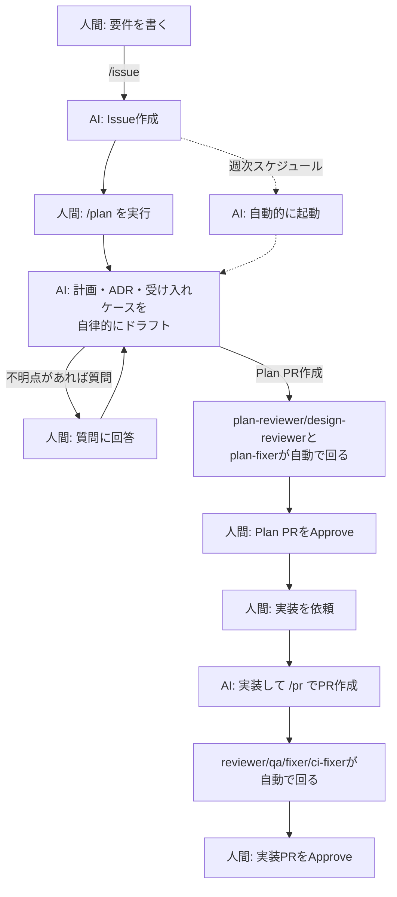

## はじめに

本記事は、個人開発でClaude CodeのProプランを利用して、

- 人間の労力を**楽に**する
- 開発時の**手戻りを少なく**する
- 品質を落とさず**継続的に**実装・レビュー・テストの一部をAI主体で回せるようにする

という仕組みを模索した内容を共有する記事です。

2026年8月現在、AI駆動開発に関する様々なキーワードが登場しています。

- ハーネスエンジニアリング
- ループエンジニアリング
- AI-DLC（AI駆動の開発ライフサイクル）、仕様駆動開発、プロンプトエンジニアリング、コンテキストエンジニアリング 等々・・・

この変化の速さがすさまじいと感じており、個人的にキャッチアップに苦労しています・・。

そんなエンジニアでもここ1ヶ月、Claude Codeを利用して、わからないなりにAI駆動による開発プロセスを整備していきました。

ただ、**最初からこういうプロセスを設計したわけではありません**。
開発を進める中で困ったことが起きるたびに、その場しのぎで仕組みを足していったら、1ヶ月後にこうなっていた、というのが実際のところです。

なので本記事は、体系的な手法の紹介ではなく、**何に困って、何を足したのか**を時系列で振り返る記事になります。

## 個人開発のリポジトリについて

今回紹介するリポジトリは[こちら](https://github.com/ebichan88/swiss-stage/tree/main)です。

リポジトリの中身としては囲碁・将棋のスイス方式トーナメント運営の効率を目的としたWebアプリケーションです。


ただ、実際にユーザーに利用されることを想定したものではなく、あくまでもClaude Codeを利用した個人開発を試してみる目的で作成したリポジトリです。

そのため、現時点ではローカル環境でのみ動作する構成であり、アプリ自体の詳細については触れません。

:::note info
過去に執筆した[GASとGoogleFormで実業団囲碁大会をDX！](https://qiita.com/ebichan_88/items/192ddb7691de4beef605)の記事で紹介したデスクトップアプリのWEB版のイメージです。
:::

## 1. 何から始めればいいか分からなかった

冒頭に挙げた通り、AI駆動開発まわりの情報はとにかく量が多く、何から手を付ければいいのか分かりません。

とりあえず手を動かすことにして、まずは[【Claude Code】マネできる！個人開発するときに最初に用意したドキュメント24種と機能要件書を全公開](https://qiita.com/tomada/items/e27292b65f723c4633d9)の記事を参考にして、次の内容を試しました。

- ChatGPTとの対話で作りたいアプリのコンセプト・要求定義のたたき台を作成
  - 後述する`01_appcadia_concept_requirements.md`ファイル
- コンセプト・要求定義の内容に基づいて、設計ドキュメントを作成

### 設計ドキュメントについて

 [【Claude Code】マネできる！個人開発するときに最初に用意したドキュメント24種と機能要件書を全公開](https://qiita.com/tomada/items/e27292b65f723c4633d9)の記事では、プロジェクト・技術設計・デザイン・ライブラリに関するドキュメントを**コンセプト・要求定義のドキュメント（`01_appcadia_concept_requirements.md`）に基づいて事前に作成しておく**、という進め方が紹介されています。

- プロジェクト： [`00_project/`](https://github.com/ebichan88/swiss-stage/blob/main/.claude/00_project/)(4本)
  - コンセプト・要求定義、インセプションデッキなど
- 技術設計: [`01_development_docs/`](https://github.com/ebichan88/swiss-stage/tree/main/.claude/01_development_docs)(15本)
  - アーキテクチャ、マッチングアルゴリズム、API設計など
- デザイン: [`02_design_system/`](https://github.com/ebichan88/swiss-stage/tree/main/.claude/02_design_system)(5本)
  - カラー、タイポグラフィ、コンポーネント設計など
- ライブラリ: [`03_library_docs/`](https://github.com/ebichan88/swiss-stage/tree/main/.claude/03_library_docs)(4本)
  - MUI、DynamoDB Enhanced Client等でハマったパターンの記録

その後の開発で一部アレンジは加えましたが、基本構成はほぼ同じです。

また、これらのドキュメントを束ねる[`CLAUDE.md`](https://github.com/ebichan88/swiss-stage/blob/main/CLAUDE.md)には、**プロジェクトの前提**(概要・技術スタック・レイヤー構成・テスト方針)と、**守ってほしい規約**を書いています。

### コンセプト・要求定義のドキュメントについて

AIに設計ドキュメントを作成してもらうために、コンセプト・要求定義のドキュメント（`01_appcadia_concept_requirements.md`）を事前に作成する必要がありました。

作りたいアプリの構想はあったため、ChatGPTに下記のプロンプトを送信して、詳細についてはAIと壁打ちして作成することにしました。

```:ChatGPTに投げたプロンプト
01_appcadia_concept_requirements.mdをステップバイステップで作成していきたいので、
ドキュメントを作成するために必要な項目ごとに私に質問してください
```

### 試してみた結果

結果として、**この立ち上がりはかなり良かった**です。最初の1週間ほどで、マッチングロジックからAPI、画面、E2Eテストまで一通り動くところまで到達できました。

そして重要なのは、この時点ではレビュー用エージェントや自動修正フローなどのAI関連の仕組みをまだ入れていない、ということです。
CIはlintとテストを回すだけ。プロセスの工夫が始まるのは、ここから先で困り始めてからでした。

## 2. AIレビューを入れたら、今度は自分が転記係になった

一人で開発していると、当然ながらコードレビューをする人がいません。

AIが書いたコードを自分で全部読むのは大変ですし、そもそも見落とします。

そこで、PRの差分をAIにレビューさせるワークフローを導入しました。
差分を読んで、`Critical` / `Major` / `Minor` の重要度別で指摘を出してくれるものです。


これ自体は良かったのですが、すぐに別の問題が出てきました。

**AIが出したレビュー指摘を、自分が読んで、またAIにコピペして「これ直して」とお願いする**という往復が発生したのです。
レビューを自動化した結果、自分がレビュー結果の転記係になってしまいました。

そのため、指摘を受けて自動で修正・pushする Fixer を追加しました。
ここから「AIの出力を人間が仲介しない」方向に、どんどん仕組みが増えていきます。

- **reviewer**: PRの差分をレビューして指摘を出す
- **fixer**: reviewerの指摘のうちCritical/Majorを修正してpush
- **ci-fixer**: CIで落ちたテスト・型エラーを修正する

### 暴走させないための安全弁

とはいえ、修正を無限にループさせるのは危険です。

そこで、修正の試行回数に上限を設けて、上限に達したら`needs-human`というラベルを付けて自動処理を止めるようにしました。また、人間がそのラベルを外すと再開します。

「AIに任せる」と「AIを止める」はセットで用意することで安全に運用することができます。

## 3. 品質が見えないことが不安になってきた

AIに任せる範囲が増えてくると、次に気になるのが品質です。動いてはいるが、テストがちゃんと書かれているのか分からない。

ここで導入した仕組みが、可視化と機械的な強制です。

- PRにカバレッジレポート(全体・差分)を自動でコメントする
- Spotless(google-java-format)で、未使用importの検出とフォーマットをCIで強制する
- 単体テストとE2E(クリティカルパスのみ)をCIで毎回実行する
- マッチング・順位計算のコアロジックは、カバレッジ90%以上(LINE・BRANCHとも)を下回るとCIを落とす

特にカバレッジは、**数字が見えるだけで安心感が全然違います**。


### カバレッジは「実行したか」しか測っていない

ただ、**カバレッジが測っているのは「そのコードを実行したか」だけ**です。極端な話、**アサーションが1行も無くても90%は達成できます**。

数字は満たされているのに中身は保証されていない、という状態になりかねないので、テストそのものの質を上げる方向でもいくつか手を入れました。

**「何をテストケースにするか」を技法で決める**

個人的にはこちらの方が効きました。テストケースの洗い出しを勘でやらないように、使う技法をドキュメントに明文化しました。

- **同値分割 / 境界値分析**
- **2因子間網羅**
  - 組み合わせが爆発する条件に使う
- **デシジョンテーブル**
  - 複数条件で結果が決まるロジックに使う
- **状態遷移テスト**
  - 不正な遷移が拒否されることまで確認する

明文化した一番の理由は、**実装をAIに委譲するときの共通語彙にするため**です。「ちゃんとテストして」ではなく「**同値分割と境界値分析で洗い出して**」と技法名で指示できる状態を目指しました。

### 「受け入れ基準」を書く場所を用意する

ただ、ここまでで見えるようになったのは、あくまで**書かれたコードの品質**です。

レビューもテストも「書かれたコードが妥当か」は見てくれますが、**そもそも作るべきものが作られているか**は誰も見ていない状態でした。実装が一部漏れていても、書かれた範囲さえきれいなら通ってしまいます。

そこで、機能ごとの受け入れ基準を、1行1ケースで管理する台帳を用意しました[^1]。

- `<コンポーネント>-AC-<3桁連番>`というIDを振り、1行1ケースで管理
- Status(`todo` → `in_progress` → `done`)で実装状況を管理
- 台帳とテストの対応が取れているかを機械的にチェックするスクリプトも用意

[^1]: 受け入れ基準にIDを振ってテストと紐づけるという発想自体は[こちらの記事](https://qiita.com/autotaker1984/items/8034eafa81866da8f363)を参考にさせてもらいました。ただし本記事で紹介している運用は、そこから独自にアレンジを重ねた結果であり、元記事の手法をそのまま適用したものではありません。

そして、この台帳とPRの差分を突き合わせて「宣言した受け入れ基準に対して、実装とテストが伴っているか」を見る **qa** エージェントと、その指摘を修正する **qa-fixer** を追加しました。2章のreviewer / fixerと同じ構成を、品質保証の側にも用意した形です。

## 4. それでもUIの手戻りは防げなかった

事前に設計ドキュメントを用意し、実装前に方針も相談していたのに、**実装後に画面を見ると気になる点が次々出てくる**、ということが何度もありました。
「あれ、なんかこの余白気になる・・」「この並びだと分かりにくい・・」と言っては、実装をやり直してもらう。

原因を考えてみると、**自分自身が、自分の求めているものを言語化できていなかった**といえます。

あいまいな指示で実装させておいて、出来上がったものを見てから「やっぱりこうじゃない」と言う。**受け手からすると一番つらい依頼の仕方**を、自分がやってしまっていました。

これに対して、2つの対策をしています。

### 対策1: 計画テンプレートにUI仕様を必須項目として埋め込む

毎回自分で気をつける、というやり方は続かないので、**計画のテンプレート自体に「UI仕様」のセクションを必須で置く**ことにしました。書くのはAIで、人間はその内容を読んで承認します。

:::note info
ここでいう「計画」は、実装前にAIに書かせるドキュメントのことです。この時点ではまだテンプレートがあるだけでしたが、後にPlan PRという形でプロセスに組み込みました(7章)。
:::

必須にしているのは、このあたりです。

- **4状態**(通常 / 空 / ローディング / エラー)をそれぞれどう見せるか
- **大量データ時**にどう見えるか
- **レスポンシブ**で何が変わるか
- 既存画面との一貫性、新しいUIパターンを増やすことになるかどうか

### 対策2: 実装前に、環境を起動せず見た目を合意する

とはいえ、文章だけで決めきれない部分もあります。そこで、新規画面や大きなレイアウト変更のときは、**計画を作る段階でStorybookによるモックも一緒に用意し**、実装前に見た目を合意できるようにしました。

APIはモックしているので、**バックエンド(Spring Boot)もDynamoDB Localも起動せずに、ブラウザでStorybookを開くだけで**4状態(通常 / 空 / ローディング / エラー)を確認できます。

また、**Claude Codeが修正のたびにセッション上で画面のキャプチャを共有してくれる**ので、それで確認が済むことも多かったです。
ただし、これは仕組みとして定義しているわけではなく、毎回そうなるとも限りません。この部分はまだ運用でカバーしている状態です。

さらに、 **Visual Regression Test(VRT)** としてPlaywrightでStorybookのスクリーンショットをPRごとに自動比較する仕組みも入れました。「見た目が変わったこと」自体は機械が検知してくれるので、人間は「それが意図した変更かどうか」の判断だけに集中できます。

## 5. 任せる範囲が広がるほど、線引きが必要になった

開発を少しずつAIに委譲していったものの、AIに任せる範囲が広いほど、品質を維持するためのルールやゲートを人間側で明確に設計する必要がありました。

レビュー等、AIに人間の判断を介在させることも重要ですが、それに加えて**AIに"帳尻合わせ"をさせない**ことを意識しました。

**テストを弱体化させていないか見張る**

AIの修正コミット(fixer / ci-fixer / qa-fixerが自動でpushするコミット)の差分に対して、テストが弱められていないかを機械的にチェックするワークフローを用意しました。
CIを通すためにアサーションを緩めたり、テストケースごと削除したりする動きを検知したら、その場でブロックします。

ちなみに、AIの最初の実装コミットやPR全体の差分も一応チェックしていますが、こちらは**警告止まり**です。テストの整理・削除には正当な理由もあり得るので、ゲートするのは「指摘を消すこと自体が目的」になりがちな自動修正コミットだけに絞っています。

**触らせない領域を決める**

マッチングや順位計算のドメインロジックのように、間違えると致命的な部分は、自動修正の対象から明示的に除外しています。

API仕様(`schema/openapi.yaml`)も同じ扱いです。エンドポイントやDTOの定義はここを唯一の正としていて、フロントの型はここから生成しています(手で書かない)。**仕様そのものをAIに書き換えられると、実装がその場しのぎで追随してしまう**ので、自動修正の対象から外しています。

**カバレッジ不足だけは、AIに直させない**

CIが落ちたとき、基本的にはAIに直させますが、**カバレッジ不足だけは自動修正を起動せず、いきなり人間に回します**。

理由は単純で、「カバレッジが足りないから上げて」とAIに丸投げすると、**中身のない水増しテストで数字を合わせられかねない**からです。数字は満たされるが品質は上がらない、という一番まずい状態になります。

## 6. 課金と向き合う

AIエージェントのレビューやテストの実行をCIで回すようになると、当然ながらコストがかかります。
また、CIの完了に時間がかかり、PRのマージに時間がかかります。

そのため、途中からモデルの変更やCIの発火条件を見直しました。

- **修正系のエージェント(fixer / ci-fixer / qa-fixer)を軽量モデルに変更した**。指摘内容が明確な修正作業には、レビューほどの推論能力は要らないためです
- **ドキュメントだけのPRでは、AIレビューやCI、E2Eをスキップする**。挙動が変わらないPRにフルセットを回しても意味がないので

「全部に全部を回さない」というだけの話ですが、体感でも待ち時間が減って快適になりました。（まだ改善できる余地はありそう・・。）

## 7. 会話は残らないので、計画そのものをPRにした

ここまでの仕組みは「実装後」の話が中心でしたが、最終的に**実装前**のプロセスにも手を入れました。

最初は、Claude CodeのPlanモードで相談して、そのまま実装をお願いしていました。ですが、**Planモードでのやり取りは、会話が終わると残りません**。何を検討して、何を却下して、なぜその方針にしたのかが消えてしまいます。

そこで、計画段階の結果を**実装前の計画書としてPR化して残す**ことにしました。これをPlan PRと呼んでいます。

- コードは1行も書かない(計画・ドキュメントのみ)
- AIが要件の不明点を質問してくる
- 人間が質問に答え、Plan PRをApproveして初めて実装に進む

複数案を比較して1つを選んだ決定は、ADR(Architecture Decision Record)として残しています。

また、3章で触れた受け入れケース台帳への追加も、このPlan PRの中で行うようにしました。**実装前に「何ができたら完成か」を`todo`として宣言しておき、実装PRで`done`に更新する**という流れです。

計画の段階で受け入れ基準まで決めておくと、実装後のqaエージェントによる突合が「事前に宣言したこと」に対する確認になるので、後付けで基準を作るより素直に回ります。

### Plan PR自体にも、reviewer/fixerと同じ構成を用意した

Plan PRを人間がレビューするだけでなく、2章のreviewer/fixerと同じ「指摘→自動修正」の構成をPlan PR自体にも適用しています。計画の抜け(異常系・境界・4状態・受け入れケースの過不足)を**plan-reviewer**が、設計ドキュメント同士の矛盾(例えばAPI仕様にエラーコードを足したのに、説明ドキュメント側が追随していない、といった状態)を**design-reviewer**が検出し、指摘は**plan-fixer**が自動修正します。

ただし、実装PRのreviewerと違って**マージをブロックするゲートにはしていません**。計画段階の「抜け」は判断がグレーになりやすく、機械的にFAIL/PASSを決めきれないためです。あくまで人間が最終判断する前の下ごしらえ、という位置づけです。

## 8. 指示を出すことすら手放し始めた

Issueに特定のラベルを付けておくと、週次のスケジュール実行で、**そのIssueに対するPlan PRのドラフトが勝手に作られるようにしました。**

これができるのは、計画を**会話ではなく成果物として残す**ようにしたからだと思っています。
Planモードのその場のやり取りだったら人間がいないと成立しませんが、Plan PRという成果物を作る作業なら、人間が不在でもトリガーできます。

「何もしていないのに、気づいたらPlan PRが用意されている」という体験は、地味ですが結構うれしいポイントです。

(頻度は今のところ週1回ですが、これは暫定でそのうち変える予定です)

## 9. 気づいたらこうなっていた

そんなこんなで1ヶ月ほど継ぎ足しを続けた結果、今の開発プロセスは Issue → Plan PR → 実装PR という3段階になりました。



この中で、**人間がやることは3つに絞られています**。

1. 要件を書く
2. 質問に答える
3. Plan PRと実装PRをApproveする

コードを直接書くことはしていません。改めて図にすると整然として見えますが、**実際には上に書いてきた通り、困るたびに継ぎ足した結果としてこの形になった**というのが正直なところです。

## おわりに

最初はどのように開発を進めるのが良いのか？となりましたが、現状と理想のギャップをAIと壁打ちすることで、1ヶ月で少しずつ開発プロセスを改善することができました。

コーディングの大半はAIに置き換えることができますが、品質保証の仕組みを考える点はまだまだ人間の介在が必要であり、QA/QEエンジニア等、品質保証にかかわるスキルの重要性が、今後さらに高まっていくのではないかと感じました。

とはいえ、本記事の例のように**何から始めるかもAIに相談**しつつ、まずはAI開発にトライしてみるのもよいかと思います
